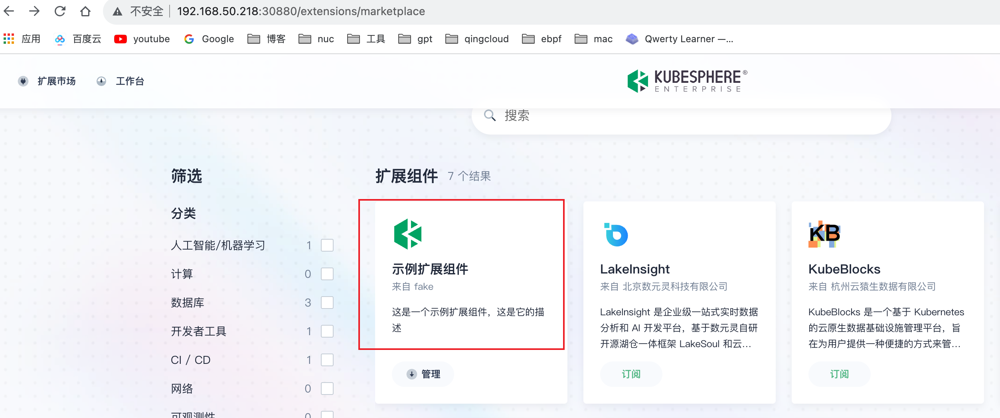
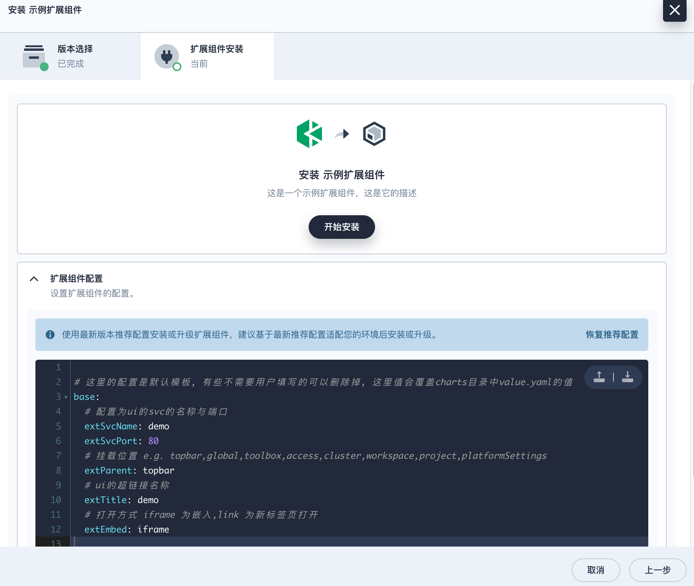
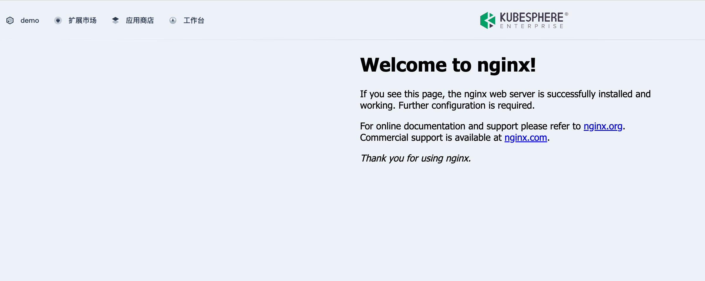
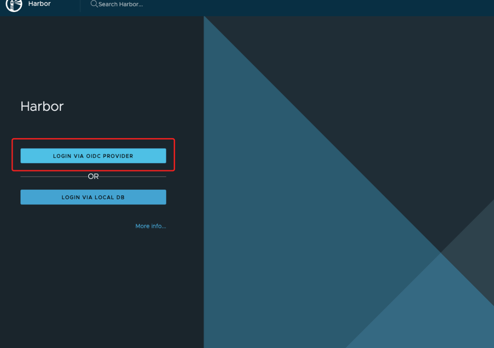

This section provides a brief introduction to developing extension, including environment preparation, extension initialization, integration scenarios, packaging and release, access control, and more. It also provides KubeSphere API and FAQ for your references.

## Environment Preparation

1. Prepare a Kubernetes Cluster

   KubeSphere Luban can be installed on any Kubernetes cluster. It is recommended to use [KubeKey](https://github.com/kubesphere/kubekey) to quickly deploy a K8s cluster.

   ```bash
   ➜ curl -sfL https://get-kk.kubesphere.io | sh -
   ./kk create cluster --with-local-storage  --with-kubernetes v1.25.4 --container-manager containerd  -y
   ```

2. Install KubeSphere Luban

   ```bash
   ➜ helm upgrade --install -n kubesphere-system --create-namespace ks-core https://charts.kubesphere.io/main/ks-core-1.1.3.tgz --debug --wait
   ```

   You can use nip.io or wildcard DNS to automatically configure access endpoints for extensions.

   ```
   --set extension.ingress.ingressClassName=<your-ingress-class-name>\
   --set extension.ingress.domainSuffix=<your-node-ip>.nip.io \
   --set extension.ingress.httpPort=<your-ingress-controller-http-port> \
   --set extension.ingress.httpsPort=<your-ingress-controller-https-port>
   ```

3. Configure Connection

   Copy the [kubeconfig](https://kubernetes.io/zh-cn/docs/concepts/configuration/organize-cluster-access-kubeconfig/) file of the K8s cluster to the `~/.kube/config` file on the development host to ensure that kubectl can access the K8s cluster normally.

   ```bash
   ➜  kubectl -n kubesphere-system get po
   NAME                                     READY   STATUS    RESTARTS       AGE
   ks-apiserver-7c67b4577b-tqqmd            1/1     Running   0              10d
   ks-console-7ffb5954d8-qr8tx              1/1     Running   0              10d
   ks-controller-manager-758dc948f5-8n4ll   1/1     Running   0              10d
   ```

4. Install Ingress Controller

    Manually install an ingress controller, and set it to NodePort, port 30888. It is recommended not to adjust this until you are familiar with the entire process.

    ```bash
    ➜ helm upgrade --install ingress-nginx ingress-nginx \
    --repo https://kubernetes.github.io/ingress-nginx \
    --namespace ingress-nginx --create-namespace \
    --set controller.service.type=NodePort \
    --set controller.service.nodePorts.http=30888
    ```

## Initialize Your Extension

Download the latest [ksbuilder](https://github.com/kubesphere/ksbuilder/releases) tool.

Use a pre-made chart package or generate a sample one.

```bash
➜ helm create demo
➜ helm package demo
# Successfully packaged chart and saved it to: /Users/inksnw/Desktop/demo-0.1.0.tgz
➜ rm -rf demo
```

Create an extension.

```bash
# --from adds the chart package from the context above
➜ ksbuilder createsimple --from=./demo-0.1.0.tgz 
```

Push the extension installation package to the cluster.

```bash
➜ ksbuilder publish demo
publish extension demo
apply resources to k8s cluster
creating Extension demo
creating ExtensionVersion demo-0.1.0
creating ConfigMap extension-demo-0.1.0-chart
```

View the newly submitted extension in the KubeSphere Marketplace.



Click to install the extension.

`extSvcName` is the name and port of your application's UI service. These parameters can be configured by the user or not placed in the top-level parameters.



After installation, click on the demo in the top left corner of the page to verify that the extension is running normally.



Verification

> `demo` is the name of the chart package, i.e., the `name` field in the `chart.yaml`.

Domain Method

After installation, you can verify by accessing the following sample addresses:

- http://demo.www.ks.com:30888/ Verify if subdomain resolution is normal.
- http://www.ks.com:30880/pstatic/dist/demo/index.js Verify if the frontend JS proxy is normal.

nip.io

- http://demo.192.168.50.208.nip.io:30888/ Verify if subdomain resolution is normal.
- http://192.168.50.208:30880/pstatic/dist/demo/index.js Verify if the frontend JS proxy is normal.

## Publish

For how to publish extensions to the KubeSphere Marketplace, please refer to [Publish Extensions](../../packaging-and-release/release/).

## OAuth Integration

Code Example

1. Create `OAuth Client` configuration.

   ```yaml
   cat << EOF | kubectl apply -f -
   apiVersion: v1
   stringData:
     configuration.yaml: |
       name: test
       secret: fake
       grantMethod: auto
       scopeRestrictions:
         - 'openid'
         - 'email'
         - 'profile'
       redirectURIs:
         - http://10.8.0.2:5556/auth/google/callback
   kind: Secret
   metadata:
     name: oauthclient
     namespace: kubesphere-system
     labels:
       config.kubesphere.io/type: oauthclient
       config.kubesphere.io/oauthclient-name: kubesphere
   type: config.kubesphere.io/oauthclient
   EOF
   ```

2. Use the example code, refer to [this code](https://github.com/coreos/go-oidc/blob/v3/example/idtoken/app.go).

   {}

   ```go
   /*
   This is an example application to demonstrate parsing an ID Token.
   */
   package main

   import (
       "crypto/rand"
       "encoding/base64"
       "encoding/json"
       "io"
       "log"
       "net/http"
       "time"

       "github.com/coreos/go-oidc/v3/oidc"
       "golang.org/x/net/context"
       "golang.org/x/oauth2"
   )

   var (
       clientID     = "test"
       clientSecret = "fake"
   )

   func randString(nByte int) (string, error) {
       b := make([]byte, nByte)
       if _, err := io.ReadFull(rand.Reader, b); err != nil {
           return "", err
       }
       return base64.RawURLEncoding.EncodeToString(b), nil
   }

   func setCallbackCookie(w http.ResponseWriter, r *http.Request, name, value string) {
       c := &http.Cookie{
           Name:     name,
           Value:    value,
           MaxAge:   int(time.Hour.Seconds()),
           Secure:   r.TLS != nil,
           HttpOnly: true,
       }
       http.SetCookie(w, c)
   }

   func main() {
       ctx := context.Background()

       provider, err := oidc.NewProvider(ctx, "http://ks-console.kubesphere-system.svc:30880")
       if err != nil {
           log.Fatal(err)
       }
       oidcConfig := &oidc.Config{
           ClientID: clientID,
       }
       verifier := provider.Verifier(oidcConfig)

       config := oauth2.Config{
           ClientID:     clientID,
           ClientSecret: clientSecret,
           Endpoint:     provider.Endpoint(),
           RedirectURL:  "http://10.8.0.2:5556/auth/google/callback",
           Scopes:       []string{oidc.ScopeOpenID, "profile", "email"},
       }

       http.HandleFunc("/", func(w http.ResponseWriter, r *http.Request) {
           state, err := randString(16)
           if err != nil {
               http.Error(w, "Internal error", http.StatusInternalServerError)
               return
           }
           nonce, err := randString(16)
           if err != nil {
               http.Error(w, "Internal error", http.StatusInternalServerError)
               return
           }
           setCallbackCookie(w, r, "state", state)
           setCallbackCookie(w, r, "nonce", nonce)

           http.Redirect(w, r, config.AuthCodeURL(state, oidc.Nonce(nonce)), http.StatusFound)
       })

       http.HandleFunc("/auth/google/callback", func(w http.ResponseWriter, r *http.Request) {
           state, err := r.Cookie("state")
           if err != nil {
               http.Error(w, "state not found", http.StatusBadRequest)
               return
           }
           if r.URL.Query().Get("state") != state.Value {
               http.Error(w, "state did not match", http.StatusBadRequest)
               return
           }

           oauth2Token, err := config.Exchange(ctx, r.URL.Query().Get("code"))
           if err != nil {
               http.Error(w, "Failed to exchange token: "+err.Error(), http.StatusInternalServerError)
               return
           }
           rawIDToken, ok := oauth2Token.Extra("id_token").(string)
           if !ok {
               http.Error(w, "No id_token field in oauth2 token.", http.StatusInternalServerError)
               return
           }
           idToken, err := verifier.Verify(ctx, rawIDToken)
           if err != nil {
               http.Error(w, "Failed to verify ID Token: "+err.Error(), http.StatusInternalServerError)
               return
           }

           nonce, err := r.Cookie("nonce")
           if err != nil {
               http.Error(w, "nonce not found", http.StatusBadRequest)
               return
           }
           if idToken.Nonce != nonce.Value {
               http.Error(w, "nonce did not match", http.StatusBadRequest)
               return
           }

           oauth2Token.AccessToken = "*REDACTED*"

           resp := struct {
               OAuth2Token   *oauth2.Token
               IDTokenClaims *json.RawMessage // ID Token payload is just JSON.
           }{oauth2Token, new(json.RawMessage)}

           if err := idToken.Claims(&resp.IDTokenClaims); err != nil {
               http.Error(w, err.Error(), http.StatusInternalServerError)
               return
           }
           data, err := json.MarshalIndent(resp, "", "    ")
           if err != nil {
               http.Error(w, err.Error(), http.StatusInternalServerError)
               return
           }
           w.Write(data)
       })

       log.Printf("listening on http://%s/", "10.8.0.2:5556")
       log.Fatal(http.ListenAndServe("10.8.0.2:5556", nil))
   }
   ```

   {}

3. Access `10.8.0.2:5556` to trigger login. After logging in, access `10.8.0.2:5556` again, and you will be able to get OAuth information.


**Note**:

1. In the Secret configuration, `name` and `secret` must match the `clientID` and `clientSecret` in the code.

2. The callback address must match.

3. The URL in `oidc.NewProvider(ctx, "http://ks-console.kubesphere-system.svc:30880")` is configured in `authentication.issuer.host` in `kubectl get cm -n kubesphere-system kubesphere-config`. If your program is not in k8s, you need to modify this URL to the actual address. For local debugging, you can achieve this by configuring the hosts file without modifying it.

   ```bash
   root@m1:~# kubectl get cm -n kubesphere-system kubesphere-config -o yaml
   apiVersion: v1
   data:
     kubesphere.yaml: |
       authentication:
         authenticateRateLimiterMaxTries: 10
         authenticateRateLimiterDuration: 10m0s
         loginHistoryRetentionPeriod: 168h
         multipleLogin: true
         issuer:
           host: "http://ks-console.kubesphere-system.svc:30880"
           ...
   kind: ConfigMap
   metadata:
     name: kubesphere-config
     namespace: kubesphere-system
   
   cat /etc/hosts
   192.168.50.218 ks-console.kubesphere-system.svc
   ```

Harbor Example

Configure Harbor to use OIDC login.

> Note: **Harbor** requires `https`, so you need to configure https for KubeSphere's web (steps omitted) and modify the `authentication.issuer.host` to the actual address.


Log in to Harbor via OIDC.



## Q&A

**Q:** Is specific storage, such as SSD, required for installing extensions?

**A:** An extension is a helm package, so you can set the storage type variable yourself and allow users to modify it manually during installation.

**Q:** If an extension has a UI interface, such as a built-in monitoring panel, how to expose it?

**A:** Use standard k8s svc exposure methods to expose it. There is no direct UI entry provided for now.

**Q:** How to use the ticketing system and message push system?

**A:** KubeSphere has integrated with multiple IM/email platforms. You can call the [KubeSphere API](https://docs.kubesphere.com.cn/reference/api/v4.0.0/introduction/) to achieve this.

**Q:** Is there an API for telemetry of extension running status?

**A:** Not currently available.