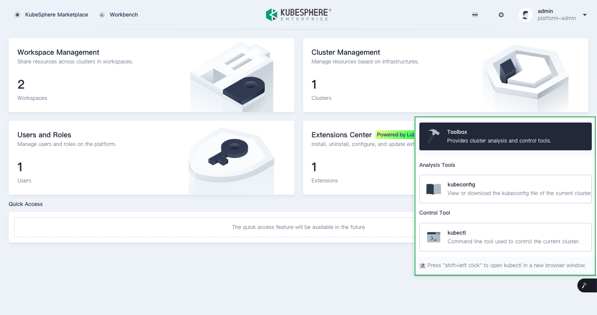

This section describes how to configure the mount point of an extension in the KubeSphere web console.

### Available mount points

You can mount extensions to the following points:

* Top navigation bar

  

* 扩展组件菜单

  在顶部菜单栏点击  图标打开菜单。

  

* Toolbox menu

  将光标悬停在页面右下角的  图标打开菜单。

  

* Left-side navigation pane

  KubeSphere provides a left-side navigation pane for each of the following module: access control, cluster management, workspace management, project management, and platform settings. Example:

  

### Configure a mount point

You can set the mount point in the `menu` object of `src/index.js`. For example:

```javascript
const menu = { 
  parent: 'global',
  name: 'hello-world',
  link: '/hellow-world',
  title: 'HELLO_WORLD',
  icon: 'cluster',
  order: 0,
  desc: 'HELLO_WORLD_DESC',
  skipAuth: true,
};
```

<table>
  <colsgroup>
    <col style="width: 25%;">
    <col style="width: 75%;">
  </colsgroup>
  <thead>
    <tr>
      <th>Parameter</th>
      <th>Description</th>
    </tr>
  <thead>
  <tbody>
    <tr>
      <td>parent</td>
      <td>The mount point of the extension. Valid values:
        <ul>
          <li><strong>topbar</strong>: mounts to the top navigation bar.</li>
          <li><strong>global</strong>：挂载到扩展组件菜单。</li>
          <li><strong>toolbox</strong>: mounts to the toolbox menu.</li>
          <li><strong>access</strong>: mounts to the left-side navigation pane on the Access Control page.</li>
          <li><strong>cluster</strong>: mounts the left-side navigation pane on the Cluster Management page.</li>
          <li><strong>workspace</strong>: mounts the left-side navigation pane on the Workspace Management page.</li>
          <li><strong>project</strong>: mounts the left-side navigation pane on the Project Management page.</li>
          <li><strong>platformSettings</strong>: mounts the left-side navigation pane on the Platform Settings page.</li>
        </ul>
      </td>
    </tr>
    <tr>
      <td>name</td>
      <td>The identifier of the extension on the menu.</td>
    </tr>
    <tr>
      <td>link</td><td>The link to the extension. This parameter is valid only when <code>parent</code> is set to <code>global</code> or <code>topbar</code>.</td>
    </tr>
    <tr>
      <td>title</td><td>The extension name displayed on the menu. We recommend that you do not hard-code the parameter settings. Instead, you can configure the parameters as keys in the UI text and enable multi-language support by using the internationalization API of KubeSphere. For more information, see <a href="../internationalization">Internationalization</a>.</td>
    </tr>
    <tr>
      <td>icon</td><td>The icon name of the extension displayed on the menu. </td>
    </tr>
    <tr>
      <td>order</td><td>The sequence of the extension on the menu. Valid values: <code>0</code> or a positive integer. Value <code>0</code> indicates that the extension is at the top of the menu.</td>
    </tr>
    <tr>
      <td>desc</td><td>The description of the extension. This parameter is valid only when <code>parent</code> is set to <code>global</code> or <code>topbar</code>. We recommend that you do not hard-code the parameter settings. Instead, you can configure the parameters as keys in the UI text and enable multi-language support by using the internationalization API of KubeSphere. For more information, see <a href="../internationalization">Internationalization</a>.</td>
    </tr>
    <tr>
      <td>skipAuth</td><td>Whether to skip user permission check. For more information, see <a href="../access-control">Access control</a>.</td>
    </tr>
  </tbody>
</table>

