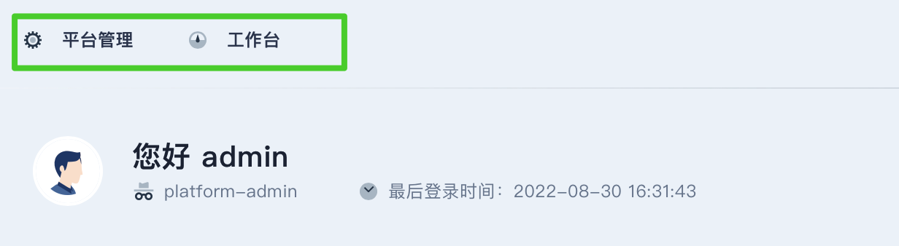
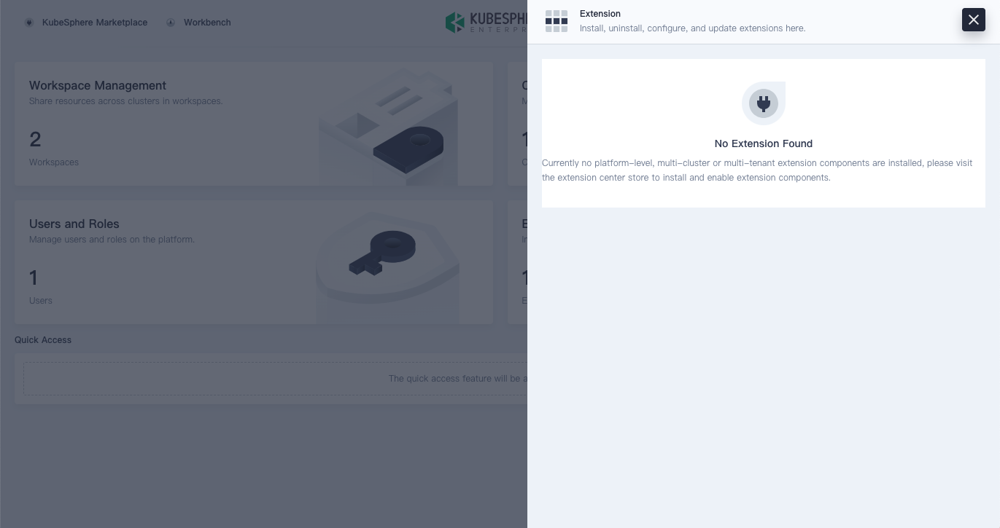
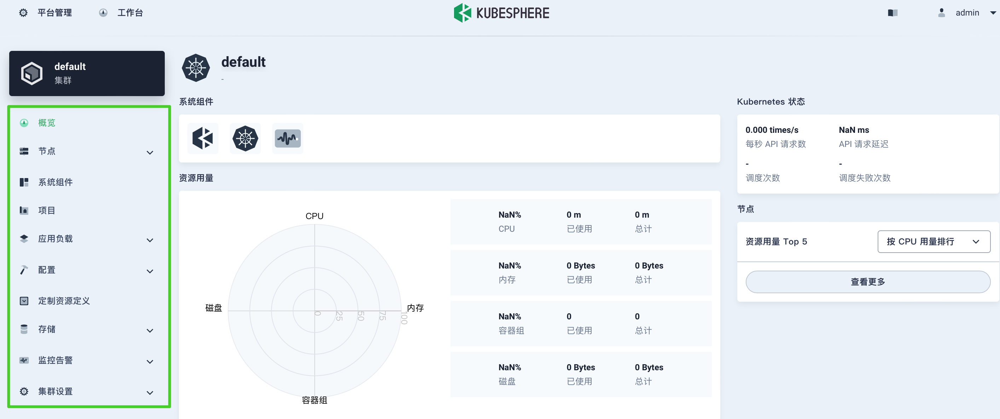

This section describes how to configure the mount point of an extension in the KubeSphere web console.

### Available mount points

You can mount extensions to the following points:

* Top navigation bar

  

* Extensions menu

  In the top navigation bar, click  to open the menu.

  

* Left navigation pane

  KubeSphere provides a left navigation pane for each of the following modules: users and roles, cluster management, workspace management, project management, and platform settings. Example:

  

### Configure a mount point

Set the mount point in the `menus` of `src/index.js`. For example:

```javascript
const menus = [
  { 
    parent: 'global',
    name: 'hello-world',
    link: '/hellow-world',
    title: 'HELLO_WORLD',
    icon: 'cluster',
    order: 0,
    desc: 'HELLO_WORLD_DESC',
    authKey: 'hello',
    authAction: 'hello-view',
    skipAuth: true,
    isCheckLicense: false,
  }
];
```

<table>
  <colsgroup>
    <col style="width: 25%;">
    <col style="width: 75%;">
  </colsgroup>
  <thead>
    <tr>
      <th>Parameter</th>
      <th>Description</th>
    </tr>
  <thead>
  <tbody>
    <tr>
      <td>parent</td>
      <td>The mount point of the extension. Valid values:
        <ul>
          <li><strong>global</strong>: mounts to the extensions menu.</li>
          <li><strong>access</strong>: mounts to the left navigation pane on the Users and Roles page.</li>
          <li><strong>cluster</strong>: mounts the left navigation pane on the Cluster Management page.</li>
          <li><strong>workspace</strong>: mounts the left navigation pane on the Workspace Management page.</li>
          <li><strong>project</strong>: mounts the left navigation pane on the Project Management page.</li>
          <li><strong>platformSettings</strong>: mounts the left navigation pane on the Platform Settings page.</li>
        </ul>
          To mount to a submenu of the current menu, set the path to: <code>parent: 'cluster.xxxx.xxxx'</code>.
      </td>
    </tr>
    <tr>
      <td>name</td>
      <td>
      <p>The identifier of the extension on the menu.</p>
      <p>Menu permission validation uses the 'name' as the key by default. Set 'authKey' to specify module permissions for validation. For more information, please refer to <a href="../access-control">Access Control</a>.</p>
</td>
    </tr>
    <tr>
      <td>link</td><td>The link to the extension. This parameter is valid only when <code>parent</code> is set to <code>global</code> or <code>topbar</code>.</td>
    </tr>
    <tr>
      <td>title</td><td>The extension name displayed on the menu. Please do not hard-code the parameter values. Instead, configure the parameters as keys in the UI text and enable multi-language support by using the internationalization API of KubeSphere. For more information, please refer to <a href="../internationalization">Internationalization</a>.</td>
    </tr>
    <tr>
      <td>icon</td><td>The icon name of the extension displayed on the menu. </td>
    </tr>
    <tr>
      <td>order</td><td>The sequence of the extension on the menu. Valid values: <code>0</code> or a positive integer. Value <code>0</code> indicates that the extension is at the top of the menu.</td>
    </tr>
    <tr>
      <td>desc</td><td>The description of the extension. This parameter is valid only when <code>parent</code> is set to <code>global</code>. We recommend that you do not hard-code the parameter settings. Instead, you can configure the parameters as keys in the UI text and enable multi-language support by using the internationalization API of KubeSphere. For more information, please refer to <a href="../internationalization">Internationalization</a>.</td>
    </tr>
    <tr>
      <td>skipAuth</td><td>Whether to skip user permission check. For more information, please refer to <a href="../access-control">Access control</a>.</td>
    </tr>
    <tr>
  <td>authKey</td><td>Configure permission filtering. For more information, please refer to <a href="../access-control">Access Control</a>.</td>
</tr>
<tr>
  <td>authAction</td><td>Configure permission items. For more information, please refer to <a href="../access-control">Access Control</a>.</td>
</tr>
     <tr>
      <td>isCheckLicense</td>
      <td>是否检测扩展组件许可，默认为 false</td>
    </tr>
  </tbody>
</table>

