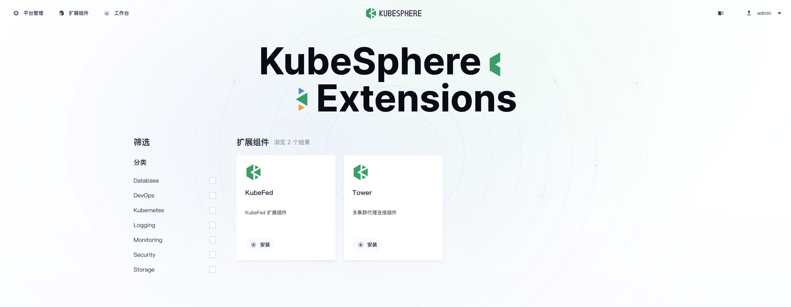

Previously, we have learnt how to develop and package extensions. In this section, we will learn how to test published extensions.

## Publish extensions

在扩展组件管理工程根目录（`~/workspace/kubesphere-extensions/`）执行下述命令，将扩展组件上架到 KubeSphere 扩展市场中。

```shell
ksbuilder publish employee
```

命令执行成功后，我们可以直接访问 KubeSphere 容器 30880 端口打开 ks-console 页面并登录，查看扩展市场中上架的组件，并进行安装测试。如果安装失败，您可以在 Console 上查看报错日志。



By default, the extension will be published on the cluster specified in the system's default kubeconfig file (`~/.kube/config`). If you want to publish the extension to a specified cluster, you can use `--kubeconfig` parameter to specify the path of the kubeconfig file.

```shell
ksbuilder publish employee --kubeconfig=/path/to/config
```