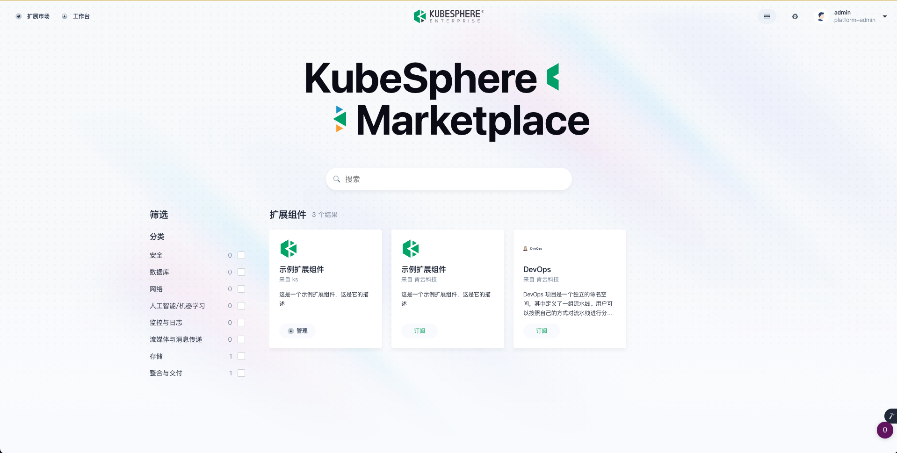
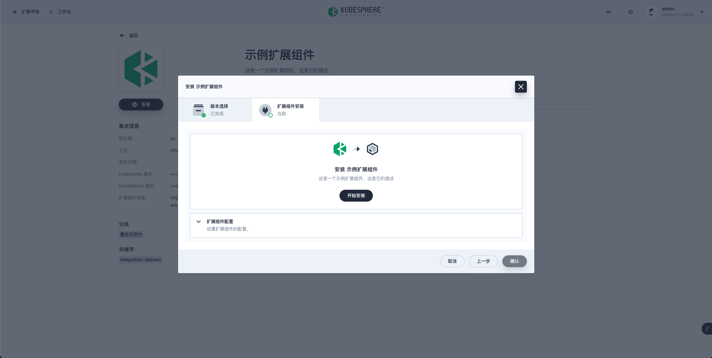
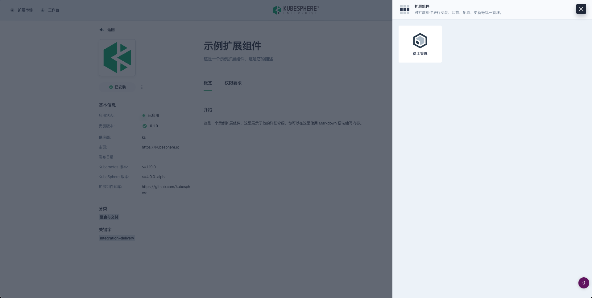
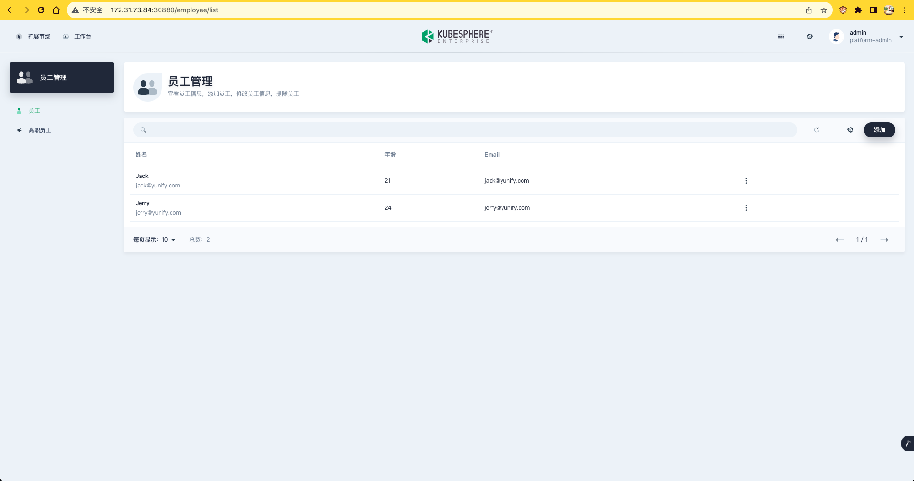

Previously, we have learnt how to develop and package extensions. In this section, we will learn how to test published extensions.

## Publish extensions

In the root directory `~/workspace/kubesphere-extensions/` of the extension, run the following command to publish the extension.

```shell
ksbuilder publish employee
```

Then you can log in to the KubeSphere Console via port 30880 and install and test the published extension.If installation fails, you can view the error log on the Console.



By default, the extension will be published on the cluster specified in the system's default kubeconfig file (`~/.kube/config`). If you want to publish the extension to a specified cluster, you can use `--kubeconfig` parameter to specify the path of the kubeconfig file.

```shell
ksbuilder publish employee --kubeconfig=/path/to/config
```

## 安装扩展组件

扩展组件安装完成后，您将可以在 KubeSphere 中使用扩展组件提供的功能。

安装扩展组件



扩展组件功能入口






