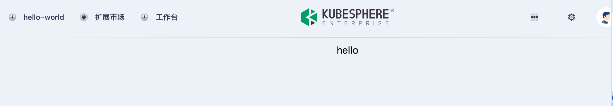
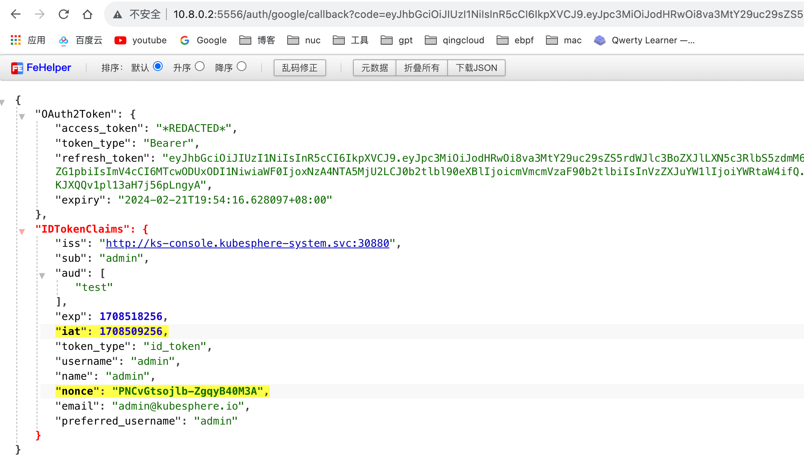

插件一般有以下几种集成场景

| **集成方式**                            | **开发成本** | 采用度 | **用户体验**                                               |
| --------------------------------------- | ------------ | ------ | ---------------------------------------------------------- |
| 编排为 Helm Chart 通过扩展上架          | 低           | 较少   | 适用于不需要 UI 界面的扩展组件，例如后台任务、数据处理等。 |
| 通过 iframe 嵌入已有的页面              | 中           | 最常见 | 适用于已有 UI 界面的扩展组件，  UI 风格可调整              |
| 基于 KubeDesign  打造自己的可视化控制台 | 高           | 较少   | 风格统一                                                   |

### iframe 嵌入

iframe 嵌入是简单Helm Chart和KubeDesign方式的超集, 这个流程通了,另外两种也就清楚了, 所以我们这里以iframe为例完成整个流程

写一个简单web, 并用nginx运行起来

首页:` index.html`

> 注意, 这里资源都使用的相对路径, 下文会提到这一点

```html
<!doctype html>
<html lang="en">
<head>
    <meta charset="UTF-8">
    <link rel="stylesheet" href="./a.css">
    <script type="text/javascript" src="./a.js"></script>
</head>
<body>
    hello
</body>
</html>
```

样式:  `a.css`

```css
body {
    display: flex;
    justify-content: center;
    align-items: center;
}
```

js文件: `a.js`

```js
document.addEventListener('DOMContentLoaded', function () {
    console.log("hello iframe")
});
```

找一台主机运行这个web, 我这里使用`nginx`代理它, 监听于`10.8.0.2`

配置反向代理

```yaml
apiVersion: extensions.kubesphere.io/v1alpha1
kind: ReverseProxy
metadata:
  name: weave.works
spec:
  directives:
    headerUp:
    - -Authorization
    stripPathPrefix: /proxy/abc
  matcher:
    method: '*'
    path: /proxy/abc/*
  upstream:
    url: http://10.8.0.2 # 简单web的运行地址, 10.8.0.2是我的开发主机, 实际环境为业务的svc地址
status:
  state: Available
```

修改hello-world代码

`kubesphere-extensions/ks-console/extensions/hello-world/src/App.jsx`

```js
import React, {useState, useRef, useEffect} from 'react';
import {Loading} from '@kubed/components';

export default function App() {
    const [loading, setLoading] = useState(true);
    const FRAME_URL = '/proxy/abc/';
    const iframeRef = useRef();
    const onIframeLoad = () => {
        setLoading(false);
    };

    return (
        <>
            {loading && <Loading className="page-loading"/>}
            <iframe
                ref={iframeRef}
                src={FRAME_URL}
                width="100%"
                height="100%"
                frameBorder="0"
                style={{
                    height: 'calc(100vh - 68px)',
                    display: loading ? 'none' : 'block',
                }}
                onLoad={onIframeLoad}
            />
        </>
    );
}
```

`yarn dev `运行, 访问即可看到已经嵌入了页面



### 问题1: js无法加载

虽然页面正常显示, 但是打开f12会发现js没有正常载入


解决方案
配置 `kubesphere-extensions/ks-console/configs/webpack.config.js`

```js
const { merge } = require('webpack-merge');
const baseConfig = require('@ks-console/bootstrap/webpack/webpack.dev.conf');

const webpackDevConfig = merge(baseConfig, {
  devServer: {
    proxy: {
      '/proxy': {
        target: 'http://192.168.50.218:30881', // 修改为目标 ks-apiserver 的地址
        onProxyReq: (proxyReq, req, res) => {
            const username = 'admin'        // 请求代理时的用户凭证
            const password = 'P@88w0rd'
            const auth = Buffer.from(`${username}:${password}`).toString("base64");
            proxyReq.setHeader('Authorization', `Basic ${auth}`);
          },
      },
    },
  },
});

module.exports = webpackDevConfig;
```

> 1.能不能直接整合进脚手架 
>
> 2.请求代理时的用户名和密码只能更编码么, 修改了怎么办(这个只在开发模式用到, 所以没关系?)

### 问题2: 资源绝对路径

资源文件使用的是绝对路径, 此时使用iframe载入会出现加载不了的情况, 例如我们修改`index.html`中的`"/a.css"`

```html
<!doctype html>
<html lang="en">
<head>
    <meta charset="UTF-8">
    <link rel="stylesheet" href="/a.css">
    <script type="text/javascript" src="./a.js"></script>
</head>
<body>
    hello
</body>
</html>
```

此时查看页面


虽然css文件显示200, 但实际并未获取到预期的css, 文字没有居中

#### 解决方案一

修改应用代码, 将资源改为相对路径, 如果项目是webpack打包的, 可以配置编译文件统一修改加载路径

@安冬奕 补充示例操作

```
```

#### 解决方案二

通过域名加载iframe,   实际环境中, 可以通过`ingress` 配置实现域名, 我这里简单配置hosts实现

```js
export default function App() {
    const [loading, setLoading] = useState(true);
    // const FRAME_URL = '/proxy/abc/';
    const FRAME_URL = 'http://www.imac.com';
  ...
```

这种情况不再需要配置 `ReverseProxy` ,当然由于不再经过ks的代理, 也就无法使用权限限制了

### 问题3: 用户信息获取

默认的token信息由于是`HttpOnly`的,js无法取得, 我们可以在扩展代码中可以通过`globals.user`拿到用户信息, 再传给iframe组件即可

在`kubesphere-extensions/ks-console/extensions/hello-world/src/App.jsx`中添加如下代码

```js
useEffect(() => {
        window.addEventListener(
            'message',
            event => {
                try {
                    if (event.data) {
                        const data = JSON.parse(event.data);
                        if (data.event_id === 'getUserInfo') {
                            event.source.postMessage(
                                JSON.stringify({
                                    event_id: data.cb_event_id,
                                    data: globals.user,
                                }),
                            );
                        }
                    }
                } catch (error) {
                    //console.error(error);
                }
            },
            '*',
        );
    }, []);
```

在业务代码`a.js`中添加如下代码

```js
window.onload = () => {
    window.addEventListener('message', event => {
        try {
            if (event.data) {
                const data = JSON.parse(event.data);
                if (data.event_id === 'getUserInfo') {
                    console.log('iframe中取得', data.data);
                }
            }
        } catch (error) {
            console.error(error);
        }
    });

    window.parent.postMessage(
        JSON.stringify({
            event_id: 'getUserInfo',
            cb_event_id: 'getUserInfo',
        }),
        '*',
    );
}
```


即可在iframe的页面中, 取得用户信息

> 域名的方式拿不到? @安冬奕

### 问题4: oauth对接

#### 代码示例

创建 `OAuth Client` 配置

```yaml
cat << EOF | kubectl apply -f -
apiVersion: v1
stringData:
  configuration.yaml: |
    name: test 
    secret: fake 
    grantMethod: auto
    scopeRestrictions:
      - 'openid'
      - 'email'
      - 'profile'
    redirectURIs:
      - http://10.8.0.2:5556/auth/google/callback 
kind: Secret
metadata:
  name: oauthclient
  namespace: kubesphere-system
  labels:
    config.kubesphere.io/type: oauthclient
    config.kubesphere.io/oauthclient-name: kubesphere
type: config.kubesphere.io/oauthclient
EOF
```

使用示例代码, [参考代码](https://github.com/coreos/go-oidc/blob/v3/example/idtoken/app.go)

{}

```go
/*
This is an example application to demonstrate parsing an ID Token.
*/
package main

import (
    "crypto/rand"
    "encoding/base64"
    "encoding/json"
    "io"
    "log"
    "net/http"
    "time"

    "github.com/coreos/go-oidc/v3/oidc"
    "golang.org/x/net/context"
    "golang.org/x/oauth2"
)

var (
    clientID     = "test"
    clientSecret = "fake"
)

func randString(nByte int) (string, error) {
    b := make([]byte, nByte)
    if _, err := io.ReadFull(rand.Reader, b); err != nil {
        return "", err
    }
    return base64.RawURLEncoding.EncodeToString(b), nil
}

func setCallbackCookie(w http.ResponseWriter, r *http.Request, name, value string) {
    c := &http.Cookie{
        Name:     name,
        Value:    value,
        MaxAge:   int(time.Hour.Seconds()),
        Secure:   r.TLS != nil,
        HttpOnly: true,
    }
    http.SetCookie(w, c)
}

func main() {
    ctx := context.Background()

    provider, err := oidc.NewProvider(ctx, "http://ks-console.kubesphere-system.svc:30880")
    if err != nil {
        log.Fatal(err)
    }
    oidcConfig := &oidc.Config{
        ClientID: clientID,
    }
    verifier := provider.Verifier(oidcConfig)

    config := oauth2.Config{
        ClientID:     clientID,
        ClientSecret: clientSecret,
        Endpoint:     provider.Endpoint(),
        RedirectURL:  "http://10.8.0.2:5556/auth/google/callback",
        Scopes:       []string{oidc.ScopeOpenID, "profile", "email"},
    }

    http.HandleFunc("/", func(w http.ResponseWriter, r *http.Request) {
        state, err := randString(16)
        if err != nil {
            http.Error(w, "Internal error", http.StatusInternalServerError)
            return
        }
        nonce, err := randString(16)
        if err != nil {
            http.Error(w, "Internal error", http.StatusInternalServerError)
            return
        }
        setCallbackCookie(w, r, "state", state)
        setCallbackCookie(w, r, "nonce", nonce)

        http.Redirect(w, r, config.AuthCodeURL(state, oidc.Nonce(nonce)), http.StatusFound)
    })

    http.HandleFunc("/auth/google/callback", func(w http.ResponseWriter, r *http.Request) {
        state, err := r.Cookie("state")
        if err != nil {
            http.Error(w, "state not found", http.StatusBadRequest)
            return
        }
        if r.URL.Query().Get("state") != state.Value {
            http.Error(w, "state did not match", http.StatusBadRequest)
            return
        }

        oauth2Token, err := config.Exchange(ctx, r.URL.Query().Get("code"))
        if err != nil {
            http.Error(w, "Failed to exchange token: "+err.Error(), http.StatusInternalServerError)
            return
        }
        rawIDToken, ok := oauth2Token.Extra("id_token").(string)
        if !ok {
            http.Error(w, "No id_token field in oauth2 token.", http.StatusInternalServerError)
            return
        }
        idToken, err := verifier.Verify(ctx, rawIDToken)
        if err != nil {
            http.Error(w, "Failed to verify ID Token: "+err.Error(), http.StatusInternalServerError)
            return
        }

        nonce, err := r.Cookie("nonce")
        if err != nil {
            http.Error(w, "nonce not found", http.StatusBadRequest)
            return
        }
        if idToken.Nonce != nonce.Value {
            http.Error(w, "nonce did not match", http.StatusBadRequest)
            return
        }

        oauth2Token.AccessToken = "*REDACTED*"

        resp := struct {
            OAuth2Token   *oauth2.Token
            IDTokenClaims *json.RawMessage // ID Token payload is just JSON.
        }{oauth2Token, new(json.RawMessage)}

        if err := idToken.Claims(&resp.IDTokenClaims); err != nil {
            http.Error(w, err.Error(), http.StatusInternalServerError)
            return
        }
        data, err := json.MarshalIndent(resp, "", "    ")
        if err != nil {
            http.Error(w, err.Error(), http.StatusInternalServerError)
            return
        }
        w.Write(data)
    })

    log.Printf("listening on http://%s/", "10.8.0.2:5556")
    log.Fatal(http.ListenAndServe("10.8.0.2:5556", nil))
}
```
{}

访问`10.8.0.2:5556` 会触发登录, 登录后再访问`10.8.0.2:5556`可以看到已经可以拿到oauth信息



**几点注意**:

1. Secret的配置中, `name`与`secret`要与代码中的`clientID`和`clientSecret`一致

2. 回调地址要一致

3. `oidc.NewProvider(ctx, "http://ks-console.kubesphere-system.svc:30880")` 中的这个url配置于`kubectl get cm -n kubesphere-system kubesphere-config` 的`authentication.issuer.host`中, 如果你的程序并不在k8s中, 需要把它改成实际的地址, 本地调试可通过配置hosts实现不修改

   ```bash
   root@m1:~# kubectl get cm -n kubesphere-system kubesphere-config -o yaml
   apiVersion: v1
   data:
     kubesphere.yaml: |
       authentication:
         authenticateRateLimiterMaxTries: 10
         authenticateRateLimiterDuration: 10m0s
         loginHistoryRetentionPeriod: 168h
         multipleLogin: true
         issuer:
           host: "http://ks-console.kubesphere-system.svc:30880"
           ...
   kind: ConfigMap
   metadata:
     name: kubesphere-config
     namespace: kubesphere-system
     
   cat /etc/hosts
   192.168.50.218 ks-console.kubesphere-system.svc
   ```

#### harbor示例

配置harbor使用oidc登录, 注意harbor要求使用`https` , 因此需要为ks的web配置https(操作略), 并修改上文中提到的`authentication.issuer.host` 为实际的值


通过OIDC 登录Harbor


