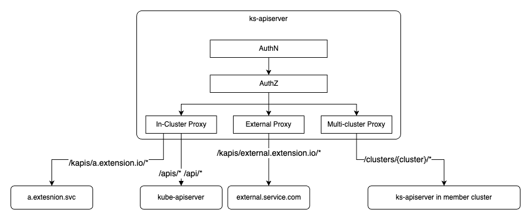

KubeSphere 构建在 K8s 之上，和 K8s 一样也具备高度可配置和可扩展的特性，除了可以借助 [K8s 的扩展机制](https://kubernetes.io/docs/concepts/extend-kubernetes/)来扩展 KubeSphere 的平台能力之外，KubeSphere 还提供了更为灵活的扩展方式。

`ks-apiserver` 是 KubeSphere 的 API 网关，提供了统一的认证、鉴权和请求代理能力，借助 `ks-apiserver` 的聚合层可以对 KubeSphere 的 API 进行扩展：

### 认证与鉴权

KubeSphere 提供了统一用户管理和的 API 认证能力，提供了统一的的多租户体系和[基于角色的访问控制](https://dev-guide.kubesphere.io/extension-dev-guide/zh/feature-customization/access-control/)能力，在对 KubeSphere API 进行扩展的时候可以很容易的复用这些能力。

### 请求代理

KubeSphere 的聚合层为扩展组件提供了统一的代理转发能力，通过简单的配置可以将请求转发到集群内部、集群外部或者被纳管的 K8s 集群中，请参考[API 扩展章节](https://dev-guide.kubesphere.io/extension-dev-guide/zh/feature-customization/extending-api/)。
