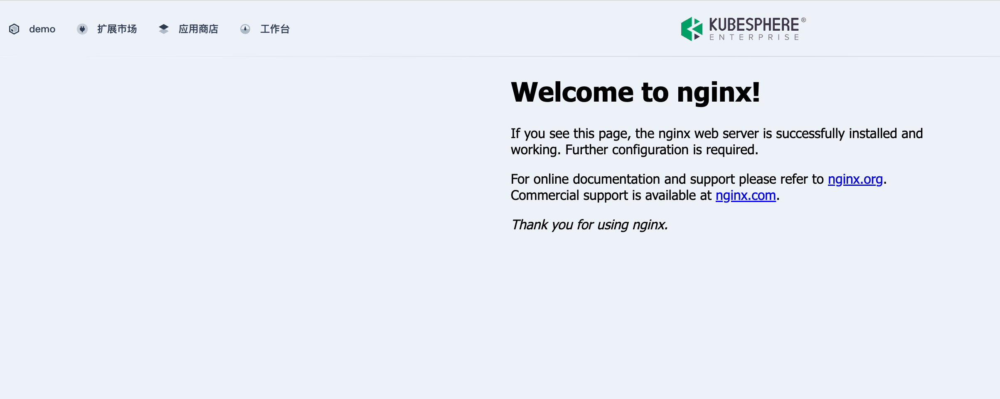
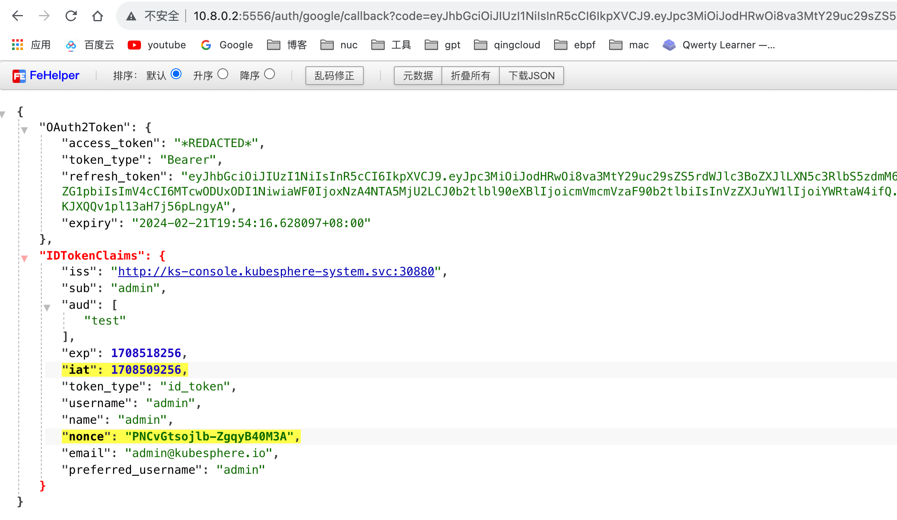
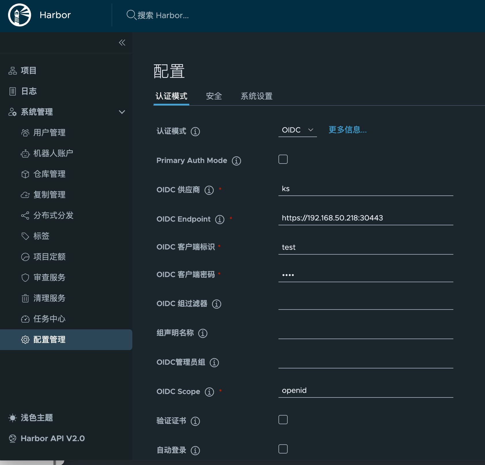

本节将简要介绍如何开发扩展组件，包括环境准备、扩展组件初始化、集成场景、打包发布、访问控制等方面，并提供 KubeSphere API 和 FAQ 供您参考。

## 环境准备

1. 准备 Kubernetes 集群

   KubeSphere Luban 在任何 Kubernetes 集群上均可安装。建议使用 [KubeKey](https://github.com/kubesphere/kubekey) 快速部署 K8s 集群。

   ```bash
   ➜ curl -sfL https://get-kk.kubesphere.io | sh -
   ./kk create cluster --with-local-storage  --with-kubernetes v1.25.4 --container-manager containerd  -y
   ```

2. 安装 KubeSphere Luban


   ```bash
   ➜ helm upgrade --install -n kubesphere-system --create-namespace ks-core https://charts.kubesphere.io/main/ks-core-1.1.3.tgz --debug --wait

3. 配置连接

   复制 K8s 集群的 [kubeconfig](https://kubernetes.io/zh-cn/docs/concepts/configuration/organize-cluster-access-kubeconfig/) 配置文件到开发主机的`~/.kube/config`，确保可以使用 kubectl 正常访问 K8s 集群。

   ```bash
   ➜  kubectl -n kubesphere-system get po
   NAME                                     READY   STATUS    RESTARTS       AGE
   ks-apiserver-7c67b4577b-tqqmd            1/1     Running   0              10d
   ks-console-7ffb5954d8-qr8tx              1/1     Running   0              10d
   ks-controller-manager-758dc948f5-8n4ll   1/1     Running   0              10d
   ```

安装ingress控制器

手动安装一个ingress控制器, 默认设置为NodePort模式,端口30888, 在您熟悉整个流程前, 建议不要调整

```bash
➜ helm upgrade --install ingress-nginx ingress-nginx \
  --repo https://kubernetes.github.io/ingress-nginx \
  --namespace ingress-nginx --create-namespace \
  --set controller.service.type=NodePort \
  --set controller.service.nodePorts.http=30888
```

## 初始化扩展组件

下载最新的 [ksbuilder](https://github.com/kubesphere/ksbuilder/releases) 工具

使用一个已制作好的chart包,或者生成一个示例的

```bash
➜ helm create demo
➜ helm package demo
# Successfully packaged chart and saved it to: /Users/inksnw/Desktop/demo-0.1.0.tgz
➜ rm -rf demo
```

创建扩展

```bash
# --from 添加上文中的chart包
➜ ksbuilder createsimple --from=./demo-0.1.0.tgz 
```

推送组件安装包到集群。

```bash
➜ ksbuilder publish demo
publish extension demo
apply resources to k8s cluster
creating Extension demo
creating ExtensionVersion demo-0.1.0
creating ConfigMap extension-demo-0.1.0-chart
```

1. 在扩展市场查看刚提交的组件。
   

2. 点击安装。

extSvcName为 你应用ui的svc名称与端口,  这些参数您可以交由使用者配置, 也可以不放在最外层的参数中


安装完成后，点击页面左上角的 demo，验证扩展组件是否正常运行。


验证

> demo为chart包的名字,即chart.yaml中的name字段

域名方式

安装后, 您可以访问以下示例地址验证

- http://demo.www.ks.com:30888/ 验证子域名解析是否正常
- http://www.ks.com:30880/pstatic/dist/demo/index.js 验证前端js代理是否正常

nip.io

- http://demo.192.168.50.208.nip.io:30888/ 验证子域名解析是否正常
- http://192.168.50.208:30880/pstatic/dist/demo/index.js 验证前端js代理是否正常

## 发布

如何发布扩展组件到扩展市场，请参阅[发布扩展组件](../../packaging-and-release/release/)。

## oauth 对接

代码示例

1. 创建 `OAuth Client` 配置。

   ```yaml
   cat << EOF | kubectl apply -f -
   apiVersion: v1
   stringData:
     configuration.yaml: |
       name: test
       secret: fake
       grantMethod: auto
       scopeRestrictions:
         - 'openid'
         - 'email'
         - 'profile'
       redirectURIs:
         - http://10.8.0.2:5556/auth/google/callback
   kind: Secret
   metadata:
     name: oauthclient
     namespace: kubesphere-system
     labels:
       config.kubesphere.io/type: oauthclient
       config.kubesphere.io/oauthclient-name: kubesphere
   type: config.kubesphere.io/oauthclient
   EOF
   ```

2. 使用示例代码，可参考[此代码](https://github.com/coreos/go-oidc/blob/v3/example/idtoken/app.go)。

   {}

   ```go
   /*
   This is an example application to demonstrate parsing an ID Token.
   */
   package main

   import (
       "crypto/rand"
       "encoding/base64"
       "encoding/json"
       "io"
       "log"
       "net/http"
       "time"

       "github.com/coreos/go-oidc/v3/oidc"
       "golang.org/x/net/context"
       "golang.org/x/oauth2"
   )

   var (
       clientID     = "test"
       clientSecret = "fake"
   )

   func randString(nByte int) (string, error) {
       b := make([]byte, nByte)
       if _, err := io.ReadFull(rand.Reader, b); err != nil {
           return "", err
       }
       return base64.RawURLEncoding.EncodeToString(b), nil
   }

   func setCallbackCookie(w http.ResponseWriter, r *http.Request, name, value string) {
       c := &http.Cookie{
           Name:     name,
           Value:    value,
           MaxAge:   int(time.Hour.Seconds()),
           Secure:   r.TLS != nil,
           HttpOnly: true,
       }
       http.SetCookie(w, c)
   }

   func main() {
       ctx := context.Background()

       provider, err := oidc.NewProvider(ctx, "http://ks-console.kubesphere-system.svc:30880")
       if err != nil {
           log.Fatal(err)
       }
       oidcConfig := &oidc.Config{
           ClientID: clientID,
       }
       verifier := provider.Verifier(oidcConfig)

       config := oauth2.Config{
           ClientID:     clientID,
           ClientSecret: clientSecret,
           Endpoint:     provider.Endpoint(),
           RedirectURL:  "http://10.8.0.2:5556/auth/google/callback",
           Scopes:       []string{oidc.ScopeOpenID, "profile", "email"},
       }

       http.HandleFunc("/", func(w http.ResponseWriter, r *http.Request) {
           state, err := randString(16)
           if err != nil {
               http.Error(w, "Internal error", http.StatusInternalServerError)
               return
           }
           nonce, err := randString(16)
           if err != nil {
               http.Error(w, "Internal error", http.StatusInternalServerError)
               return
           }
           setCallbackCookie(w, r, "state", state)
           setCallbackCookie(w, r, "nonce", nonce)

           http.Redirect(w, r, config.AuthCodeURL(state, oidc.Nonce(nonce)), http.StatusFound)
       })

       http.HandleFunc("/auth/google/callback", func(w http.ResponseWriter, r *http.Request) {
           state, err := r.Cookie("state")
           if err != nil {
               http.Error(w, "state not found", http.StatusBadRequest)
               return
           }
           if r.URL.Query().Get("state") != state.Value {
               http.Error(w, "state did not match", http.StatusBadRequest)
               return
           }

           oauth2Token, err := config.Exchange(ctx, r.URL.Query().Get("code"))
           if err != nil {
               http.Error(w, "Failed to exchange token: "+err.Error(), http.StatusInternalServerError)
               return
           }
           rawIDToken, ok := oauth2Token.Extra("id_token").(string)
           if !ok {
               http.Error(w, "No id_token field in oauth2 token.", http.StatusInternalServerError)
               return
           }
           idToken, err := verifier.Verify(ctx, rawIDToken)
           if err != nil {
               http.Error(w, "Failed to verify ID Token: "+err.Error(), http.StatusInternalServerError)
               return
           }

           nonce, err := r.Cookie("nonce")
           if err != nil {
               http.Error(w, "nonce not found", http.StatusBadRequest)
               return
           }
           if idToken.Nonce != nonce.Value {
               http.Error(w, "nonce did not match", http.StatusBadRequest)
               return
           }

           oauth2Token.AccessToken = "*REDACTED*"

           resp := struct {
               OAuth2Token   *oauth2.Token
               IDTokenClaims *json.RawMessage // ID Token payload is just JSON.
           }{oauth2Token, new(json.RawMessage)}

           if err := idToken.Claims(&resp.IDTokenClaims); err != nil {
               http.Error(w, err.Error(), http.StatusInternalServerError)
               return
           }
           data, err := json.MarshalIndent(resp, "", "    ")
           if err != nil {
               http.Error(w, err.Error(), http.StatusInternalServerError)
               return
           }
           w.Write(data)
       })

       log.Printf("listening on http://%s/", "10.8.0.2:5556")
       log.Fatal(http.ListenAndServe("10.8.0.2:5556", nil))
   }
   ```

   {}

3. 访问 `10.8.0.2:5556` 将触发登录，登录后再次访问 `10.8.0.2:5556`，您将能够获取到 OAuth 信息。


**注意**:

1. Secret 的配置中，`name` 和 `secret` 要与代码中的 `clientID` 和`clientSecret` 一致。

2. 回调地址要一致。

3. `oidc.NewProvider(ctx, "http://ks-console.kubesphere-system.svc:30880")` 中的 url 被配置在`kubectl get cm -n kubesphere-system kubesphere-config` 的`authentication.issuer.host`下。如果您的程序并不在 k8s 中，需要将此 URL 修改为实际地址。在本地调试时，可以通过配置 hosts 文件实现，而无需修改。

   ```bash
   root@m1:~# kubectl get cm -n kubesphere-system kubesphere-config -o yaml
   apiVersion: v1
   data:
     kubesphere.yaml: |
       authentication:
         authenticateRateLimiterMaxTries: 10
         authenticateRateLimiterDuration: 10m0s
         loginHistoryRetentionPeriod: 168h
         multipleLogin: true
         issuer:
           host: "http://ks-console.kubesphere-system.svc:30880"
           ...
   kind: ConfigMap
   metadata:
     name: kubesphere-config
     namespace: kubesphere-system
   
   cat /etc/hosts
   192.168.50.218 ks-console.kubesphere-system.svc
   ```

Harbor 示例

配置 Harbor 使用 OIDC 登录。

> 注意: **Harbor** 要求使用 `https` ，因此需要为 KubeSphere 的 web 配置 https （操作略），并修改上述 `authentication.issuer.host` 为实际地址。



通过 OIDC 登录 Harbor。


## Q&A

**Q:** 安装扩展组件时是否需要特定的存储，如 SSD？

**A:** 扩展组件是一个 helm 包，所以可以自行设置存储类型变量，让用户在安装时手动修改。

**Q:** 扩展组件有 UI 界面，如自带一个监控面板，如何暴露？

**A:** 使用标准的 k8s svc 暴露方式自行进行暴露，暂时没有提供直接的 UI 入口。

**Q:** 如何使用工单系统和信息推送系统？

**A:** KubeSphere 实现了多种 IM/邮件等平台的对接，您可以调用 [KubeSphere API](https://docs.kubesphere.com.cn/reference/api/v4.0.0/introduction/) 来实现。

**Q:** 是否存在用于遥测扩展组件运行状态的 API？

**A:** 暂时没有。
