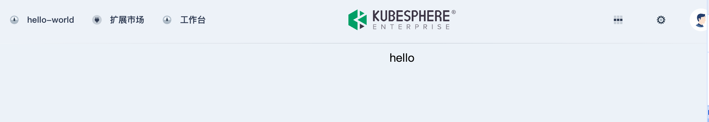
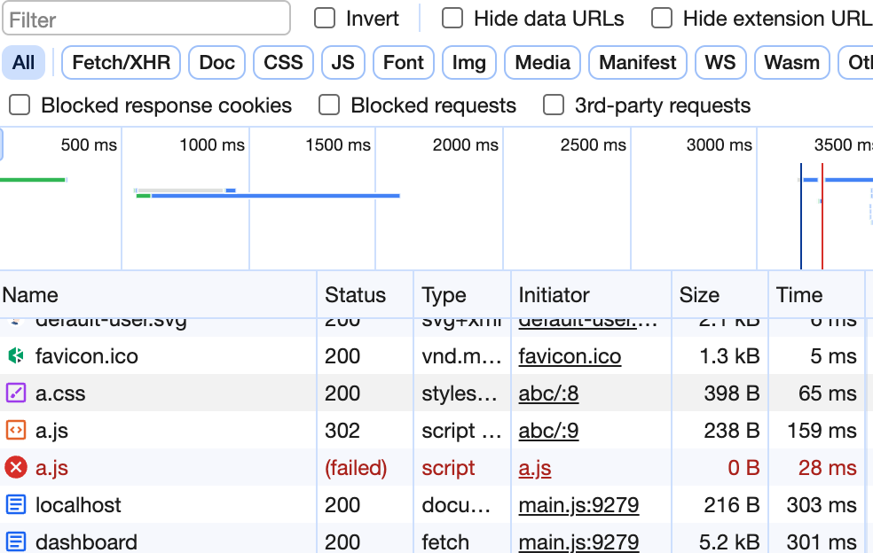
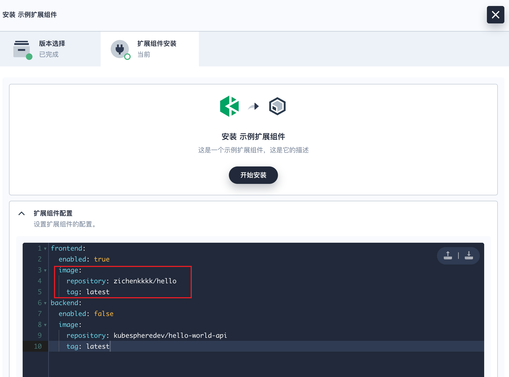
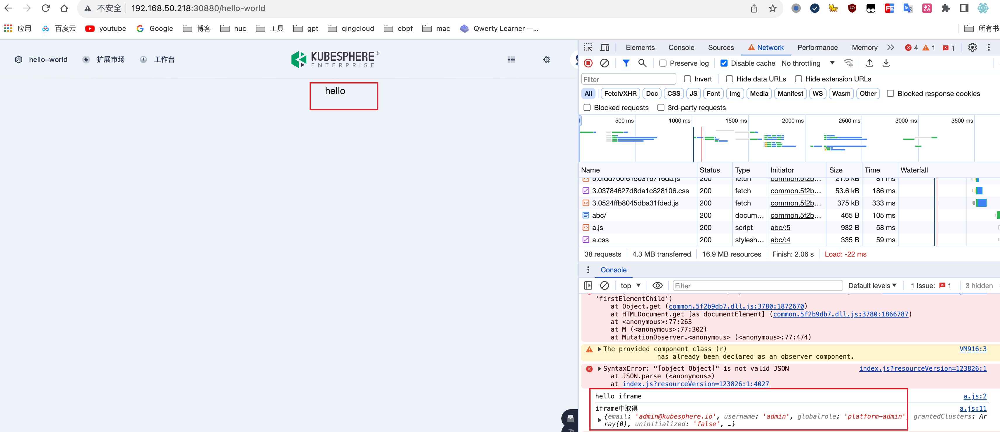
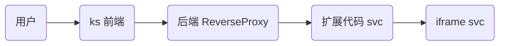
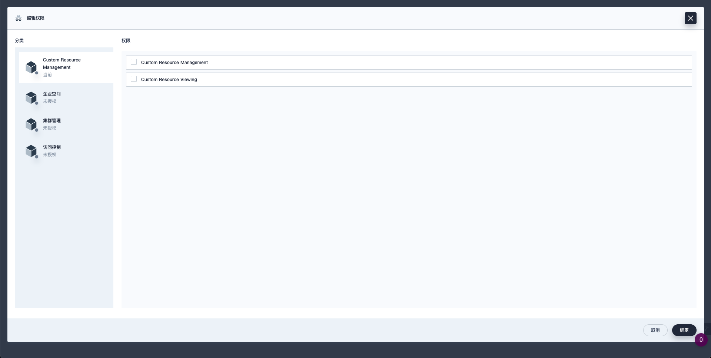

本节将简要介绍如何开发扩展组件，包括环境准备、扩展组件初始化、集成场景、打包发布、访问控制等方面，并提供 KubeSphere API 和 FAQ 供您参考。

## 环境准备

1. 准备 Kubernetes 集群

   KubeSphere Luban 在任何 Kubernetes 集群上均可安装。建议使用 [KubeKey](https://github.com/kubesphere/kubekey) 快速部署 K8s 集群。

   ```bash
   curl -sfL https://get-kk.kubesphere.io | sh -
   ./kk create cluster --with-local-storage  --with-kubernetes v1.25.4 --container-manager containerd  -y
   ```

2. 安装 KubeSphere Luban

   ```bash
   helm upgrade --install -n kubesphere-system --create-namespace ks-core  https://charts.kubesphere.io/test/ks-core-0.6.3.tgz --set apiserver.nodePort=30881 --debug --wait
   ```

3. 配置连接

   复制 K8s 集群的 [kubeconfig](https://kubernetes.io/zh-cn/docs/concepts/configuration/organize-cluster-access-kubeconfig/) 配置文件到开发主机的`~/.kube/config`，确保可以使用 kubectl 正常访问 K8s 集群。

   ```bash
   ➜  kubectl -n kubesphere-system get po
   NAME                                     READY   STATUS    RESTARTS       AGE
   ks-apiserver-7c67b4577b-tqqmd            1/1     Running   0              10d
   ks-console-7ffb5954d8-qr8tx              1/1     Running   0              10d
   ks-controller-manager-758dc948f5-8n4ll   1/1     Running   0              10d
   ```

## 初始化扩展组件

1. 执行以下命令初始化扩展组件开发项目：

   ```bash
   mkdir -p ~/kubesphere-extensions
   cd ~/kubesphere-extensions
   yarn add global create-ks-project
   yarn create ks-project ks-console
   ```

2. 执行以下命令创建 Hello World 扩展组件：

   ```bash
   cd ks-console
   yarn create:ext
   ```

   根据命令提示，设置扩展组件的名称、显示名称、描述、作者和语言等基础信息，完成扩展组件创建。

   ```bash
   Extension Name hello-world
   Display Name Hello World
   Description Hello World!
   Author demo
   Language JavaScript
   Create extension [hello-world]? Yes
   ```

3. 配置本地运行环境

   在 `kubesphere-extensions/ks-console/configs/local_config.yaml` 文件中进行如下配置。

   ```yaml
   server:
     apiServer:
       url: http://192.168.50.218:30881 # ks-apiserver 的 IP 与端口地址
       wsUrl: ws://192.168.50.218:30881 # ks-apiserver 的 IP 与端口地址
   ```

4. 执行以下命令运行：

   ```bash
   cd ~/kubesphere-extensions/ks-console/
   yarn dev
   ```

5. 打开浏览器，访问 `http://localhost:8000`，使用默认用户名 `admin` 和密码 `P@88w0rd` 登录 KubeSphere 控制台，顶部导航栏将出现 `Hello World` 扩展组件的访问入口。

   

## 集成场景

扩展组件一般有以下几种集成场景：

| **集成方式**| **开发成本** | 采用度 | **用户体验**|开发工作量|扩展组件示例|
| -------------------------------------- | ------------ | ------ | ---------------------------------------------------------- | ------ | ------ | 
| 编排为 Helm Chart 通过扩展组件上架     | 低           | 较少   | 适用于不需要 UI 界面的扩展组件，例如后台任务、数据处理等。|预计开发时间为3人天。|[KubeBlocks](https://kubesphere.com.cn/marketplace/extensions/kubeblocks/)
| 通过 iframe 嵌入已有的页面             | 中           | 最常见 | 适用于已有 UI 界面的扩展组件， UI 风格可调整。             |预计开发时间为15人天。| [Databend Playground](https://kubesphere.com.cn/marketplace/extensions/databend-playground/)
| 基于 KubeDesign 打造自己的可视化控制台 | 高           | 较少   | 风格统一。                                                 |开发工作量视具体开发内容而定。| [OKG Dashboard](https://kubesphere.com.cn/marketplace/extensions/kruise-game-dashboard/)

### iframe 嵌入

iframe 嵌入是简单 Helm Chart 和 KubeDesign 方式的超集，熟悉 iframe 嵌入流程，也就熟悉另外两种集成方式了，所以这里以 iframe 为例介绍整个流程。

1. 编写一个简单的 web 服务。

   首页:`index.html`

   > 注意：这里的资源都使用相对路径，原因详见下文问题 2。

   ```html
   <!DOCTYPE html>
   <html lang="en">
     <head>
       <meta charset="UTF-8" />
       <link rel="stylesheet" href="./a.css" />
       <script type="text/javascript" src="./a.js"></script>
     </head>
     <body>
       hello
     </body>
   </html>
   ```

   样式: `a.css`

   ```css
   body {
     display: flex;
     justify-content: center;
     align-items: center;
   }
   ```

   js 文件: `a.js`

   ```js
   document.addEventListener("DOMContentLoaded", function () {
     console.log("hello iframe");
   });
   ```

2. 在一台主机上运行这个 web，使用 `nginx` 进行代理，监听该主机地址。

   配置反向代理：

   ```yaml
   apiVersion: extensions.kubesphere.io/v1alpha1
   kind: ReverseProxy
   metadata:
     name: weave.works
   spec:
     directives:
       headerUp:
         - -Authorization
       stripPathPrefix: /proxy/abc
     matcher:
       method: "*"
       path: /proxy/abc/*
     upstream:
       url: http://10.8.0.2 # web 的运行地址，请替换为实际环境中业务的 svc 地址
   status:
     state: Available
   ```

3. 修改 hello-world 代码。

   `kubesphere-extensions/ks-console/extensions/hello-world/src/App.jsx`

   ```js
   import React, { useState, useRef, useEffect } from "react";
   import { Loading } from "@kubed/components";

   export default function App() {
     const [loading, setLoading] = useState(true);
     const FRAME_URL = "/proxy/abc/";
     const iframeRef = useRef();
     const onIframeLoad = () => {
       setLoading(false);
     };

     return (
       <>
         {loading && <Loading className="page-loading" />}
         <iframe
           ref={iframeRef}
           src={FRAME_URL}
           width="100%"
           height="100%"
           frameBorder="0"
           style={{
             height: "calc(100vh - 68px)",
             display: loading ? "none" : "block",
           }}
           onLoad={onIframeLoad}
         />
       </>
     );
   }
   ```

4. 运行 `yarn dev`，访问 KubeSphere 控制台，可看到已嵌入 hello world 组件页面。

   

### 问题 1: js 无法加载

问题描述：虽然页面正常显示，但是按下 F12 会发现 js 没有正常载入。



解决方案（仅适用于开发模式）：配置 `kubesphere-extensions/ks-console/configs/webpack.config.js` 文件。

```js
const { merge } = require("webpack-merge");
const baseConfig = require("@ks-console/bootstrap/webpack/webpack.dev.conf");

const webpackDevConfig = merge(baseConfig, {
  devServer: {
    proxy: {
      "/proxy": {
        target: "http://192.168.50.218:30881", // 修改为目标 ks-apiserver 的地址
        onProxyReq: (proxyReq, req, res) => {
          const username = "admin"; // 请求代理时的用户凭证
          const password = "P@88w0rd";
          const auth = Buffer.from(`${username}:${password}`).toString(
            "base64"
          );
          proxyReq.setHeader("Authorization", `Basic ${auth}`);
        },
      },
    },
  },
});

module.exports = webpackDevConfig;
```

### 问题 2: 资源绝对路径

问题描述：

若资源文件使用的是绝对路径，此时使用 iframe 载入会出现加载不了的情况，例如修改 `index.html` 中的 `"./a.css"` 为 `"/a.css"`，再查看界面：

```html
<!DOCTYPE html>
<html lang="en">
  <head>
    <meta charset="UTF-8" />
    <link rel="stylesheet" href="/a.css" />
    <script type="text/javascript" src="./a.js"></script>
  </head>
  <body>
    hello
  </body>
</html>
```


会发现：虽然 css 文件显示 200，但实际并未获取到预期的 css，文字没有居中。

#### 解决方案一

修改应用代码，将资源改为相对路径。

如果扩展组件项目采用 webpack 打包，可以修改 `kubesphere-extensions/ks-console/configs/webpack.config.js` 中的 `output.publicPath` 配置，编译文件会统一修改加载路径。

```js
module.exports = {
  // ...other configs
  output: {
    // ...other configs
    publicPath: "https://cdn.example.com/assets/",
  },
};
```

#### 解决方案二

通过域名加载 iframe，在实际环境中，可以通过 `ingress` 配置实现域名映射。在这个简单的示例中，我们通过配置 hosts 文件来实现域名的映射。

```js
export default function App() {
    const [loading, setLoading] = useState(true);
    // const FRAME_URL = '/proxy/abc/';
    const FRAME_URL = 'http://www.imac.com';
  ...
```

在这种情况下，不再需要配置 ReverseProxy。当然，由于不再经过 KubeSphere 的代理，因此权限限制将无法生效。

### 问题 3: 用户信息获取

问题描述：默认的 token 信息是 HttpOnly 的，因此无法通过 js 直接获取。

解决方案：在扩展代码中，通过 globals.user 获取用户信息，并将其传递给 iframe 组件，即可 iframe 中使用用户信息进行相关操作。

步骤：

1. 在`kubesphere-extensions/ks-console/extensions/hello-world/src/App.jsx`中添加如下代码：

   ```js
   useEffect(() => {
     window.addEventListener(
       "message",
       (event) => {
         try {
           if (event.data) {
             const data = JSON.parse(event.data);
             if (data.event_id === "getUserInfo") {
               event.source.postMessage(
                 JSON.stringify({
                   event_id: data.cb_event_id,
                   data: globals.user,
                 })
               );
             }
           }
         } catch (error) {
           //console.error(error);
         }
       },
       "*"
     );
   }, []);
   ```

2. 在业务代码`a.js`中添加如下代码：

   ```js
   window.onload = () => {
     window.addEventListener("message", (event) => {
       try {
         if (event.data) {
           const data = JSON.parse(event.data);
           if (data.event_id === "getUserInfo") {
             console.log("iframe 中取得", data.data);
           }
         }
       } catch (error) {
         console.error(error);
       }
     });

     window.parent.postMessage(
       JSON.stringify({
         event_id: "getUserInfo",
         cb_event_id: "getUserInfo",
       }),
       "*"
     );
   };
   ```

   

即可在 iframe 的页面中，取得用户信息。


### 问题 4: oauth 对接

#### 代码示例

1. 创建 `OAuth Client` 配置。

   ```yaml
   cat << EOF | kubectl apply -f -
   apiVersion: v1
   stringData:
     configuration.yaml: |
       name: test
       secret: fake
       grantMethod: auto
       scopeRestrictions:
         - 'openid'
         - 'email'
         - 'profile'
       redirectURIs:
         - http://10.8.0.2:5556/auth/google/callback
   kind: Secret
   metadata:
     name: oauthclient
     namespace: kubesphere-system
     labels:
       config.kubesphere.io/type: oauthclient
       config.kubesphere.io/oauthclient-name: kubesphere
   type: config.kubesphere.io/oauthclient
   EOF
   ```

2. 使用示例代码，可参考[此代码](https://github.com/coreos/go-oidc/blob/v3/example/idtoken/app.go)。

   {}

   ```go
   /*
   This is an example application to demonstrate parsing an ID Token.
   */
   package main

   import (
       "crypto/rand"
       "encoding/base64"
       "encoding/json"
       "io"
       "log"
       "net/http"
       "time"

       "github.com/coreos/go-oidc/v3/oidc"
       "golang.org/x/net/context"
       "golang.org/x/oauth2"
   )

   var (
       clientID     = "test"
       clientSecret = "fake"
   )

   func randString(nByte int) (string, error) {
       b := make([]byte, nByte)
       if _, err := io.ReadFull(rand.Reader, b); err != nil {
           return "", err
       }
       return base64.RawURLEncoding.EncodeToString(b), nil
   }

   func setCallbackCookie(w http.ResponseWriter, r *http.Request, name, value string) {
       c := &http.Cookie{
           Name:     name,
           Value:    value,
           MaxAge:   int(time.Hour.Seconds()),
           Secure:   r.TLS != nil,
           HttpOnly: true,
       }
       http.SetCookie(w, c)
   }

   func main() {
       ctx := context.Background()

       provider, err := oidc.NewProvider(ctx, "http://ks-console.kubesphere-system.svc:30880")
       if err != nil {
           log.Fatal(err)
       }
       oidcConfig := &oidc.Config{
           ClientID: clientID,
       }
       verifier := provider.Verifier(oidcConfig)

       config := oauth2.Config{
           ClientID:     clientID,
           ClientSecret: clientSecret,
           Endpoint:     provider.Endpoint(),
           RedirectURL:  "http://10.8.0.2:5556/auth/google/callback",
           Scopes:       []string{oidc.ScopeOpenID, "profile", "email"},
       }

       http.HandleFunc("/", func(w http.ResponseWriter, r *http.Request) {
           state, err := randString(16)
           if err != nil {
               http.Error(w, "Internal error", http.StatusInternalServerError)
               return
           }
           nonce, err := randString(16)
           if err != nil {
               http.Error(w, "Internal error", http.StatusInternalServerError)
               return
           }
           setCallbackCookie(w, r, "state", state)
           setCallbackCookie(w, r, "nonce", nonce)

           http.Redirect(w, r, config.AuthCodeURL(state, oidc.Nonce(nonce)), http.StatusFound)
       })

       http.HandleFunc("/auth/google/callback", func(w http.ResponseWriter, r *http.Request) {
           state, err := r.Cookie("state")
           if err != nil {
               http.Error(w, "state not found", http.StatusBadRequest)
               return
           }
           if r.URL.Query().Get("state") != state.Value {
               http.Error(w, "state did not match", http.StatusBadRequest)
               return
           }

           oauth2Token, err := config.Exchange(ctx, r.URL.Query().Get("code"))
           if err != nil {
               http.Error(w, "Failed to exchange token: "+err.Error(), http.StatusInternalServerError)
               return
           }
           rawIDToken, ok := oauth2Token.Extra("id_token").(string)
           if !ok {
               http.Error(w, "No id_token field in oauth2 token.", http.StatusInternalServerError)
               return
           }
           idToken, err := verifier.Verify(ctx, rawIDToken)
           if err != nil {
               http.Error(w, "Failed to verify ID Token: "+err.Error(), http.StatusInternalServerError)
               return
           }

           nonce, err := r.Cookie("nonce")
           if err != nil {
               http.Error(w, "nonce not found", http.StatusBadRequest)
               return
           }
           if idToken.Nonce != nonce.Value {
               http.Error(w, "nonce did not match", http.StatusBadRequest)
               return
           }

           oauth2Token.AccessToken = "*REDACTED*"

           resp := struct {
               OAuth2Token   *oauth2.Token
               IDTokenClaims *json.RawMessage // ID Token payload is just JSON.
           }{oauth2Token, new(json.RawMessage)}

           if err := idToken.Claims(&resp.IDTokenClaims); err != nil {
               http.Error(w, err.Error(), http.StatusInternalServerError)
               return
           }
           data, err := json.MarshalIndent(resp, "", "    ")
           if err != nil {
               http.Error(w, err.Error(), http.StatusInternalServerError)
               return
           }
           w.Write(data)
       })

       log.Printf("listening on http://%s/", "10.8.0.2:5556")
       log.Fatal(http.ListenAndServe("10.8.0.2:5556", nil))
   }
   ```

   {}

3. 访问 `10.8.0.2:5556` 将触发登录，登录后再次访问 `10.8.0.2:5556`，您将能够获取到 OAuth 信息。


**注意**:

1. Secret 的配置中，`name` 和 `secret` 要与代码中的 `clientID` 和`clientSecret` 一致。

2. 回调地址要一致。

3. `oidc.NewProvider(ctx, "http://ks-console.kubesphere-system.svc:30880")` 中的 url 被配置在`kubectl get cm -n kubesphere-system kubesphere-config` 的`authentication.issuer.host`下。如果您的程序并不在 k8s 中，需要将此 URL 修改为实际地址。在本地调试时，可以通过配置 hosts 文件实现，而无需修改。

   ```bash
   root@m1:~# kubectl get cm -n kubesphere-system kubesphere-config -o yaml
   apiVersion: v1
   data:
     kubesphere.yaml: |
       authentication:
         authenticateRateLimiterMaxTries: 10
         authenticateRateLimiterDuration: 10m0s
         loginHistoryRetentionPeriod: 168h
         multipleLogin: true
         issuer:
           host: "http://ks-console.kubesphere-system.svc:30880"
           ...
   kind: ConfigMap
   metadata:
     name: kubesphere-config
     namespace: kubesphere-system

   cat /etc/hosts
   192.168.50.218 ks-console.kubesphere-system.svc
   ```

#### Harbor 示例

配置 Harbor 使用 OIDC 登录。

> 注意: **Harbor** 要求使用 `https` ，因此需要为 KubeSphere 的 web 配置 https （操作略），并修改上述 `authentication.issuer.host` 为实际地址。


通过 OIDC 登录 Harbor。


## 打包发布

### 镜像制作

1. 编译

   ```bash
   cd kubesphere-extensions/ks-console
   yarn build:ext hello-world
   # 生成文件
   ls kubesphere-extensions/ks-console/extensions/hello-world/dist/index.js
   ```

2. 制作镜像

   ```bash
   cd kubesphere-extensions/ks-console/extensions/hello-world/
   docker build .
   docker tag 500c030399f6 zichenkkkk/hello:latest
   docker push zichenkkkk/hello:latest
   ```

### chart 制作

1. 下载 [latest ksbuilder release](https://github.com/kubesphere/ksbuilder/releases) 并移动到 `/usr/local/bin/`，执行以下命令创建一个示例 chart。

   ```bash
   ➜ ksbuilder create
   Please input extension name: hello-world
   ✔ other
   Please input extension author: fake
   Please input Email (optional):
   Please input author's URL (optional):
   Directory: /Users/inksnw/Desktop/hello-world

   The extension charts has been created.
   ```

2. 在生成的 chart 项目 `hello-world` 中，由于 `hello-world` 组件只有前端，所以需要在`hello-world/value.yaml` 中，关闭后端，并修改前端镜像为刚刚推送的`zichenkkkk/hello:latest` 镜像。

   ```yaml
   frontend:
     enabled: true
     image:
       repository: zichenkkkk/hello
       tag: latest
   backend:
     enabled: false
     image:
       repository: kubespheredev/hello-world-api
       tag: latest
   ```

3. 打包。

   ```bash
   ➜ ksbuilder package hello-world
   package extension hello-world
   package saved to /Users/inksnw/Desktop/hello-world-0.1.0.tgz
   ```

### 测试

1. 推送组件安装包到集群。

   ```bash
   ➜ ksbuilder publish hello-world-0.1.0.tgz
   publish extension hello-world-0.1.0.tgz
   creating Extension hello-world
   creating ExtensionVersion hello-world-0.1.0
   creating ConfigMap extension-hello-world-0.1.0-chart
   ```

2. 在扩展市场查看刚提交的组件。


3. 点击安装。


4. 安装完成后，点击页面左上角的 hello-world，验证扩展组件是否正常运行。


调用链如下：



> 注意：
>
> 以下配置也需要整合进 chart 安装包中，不过在测试阶段可以暂时不整合，操作步骤省略。
>
> - 为您的 iframe 网页创建一个 Service（svc）与 Pod，即上图中的最后一步。
>
> - 后端 ReverseProxy 配置的 YAML 文件。

### 发布

如何发布扩展组件到扩展市场，请参阅[发布扩展组件](../../packaging-and-release/release/)。


## 访问控制

### 用户对接

通过前文介绍的 `oauth` 或 `iframe 消息` 的方式获取用户登录信息。

建议将超级管理员用户 `admin` 映射到扩展组件的超级管理员角色，对于普通用户，可以通过调用自身的 API 创建一个普通用户（无权限），然后由超级管理员手动分配权限。当用户点击扩展入口时，通过映射好的用户直接进入界面，无需再进行登录。

例如，访问 `http://192.168.50.218:30880/oauth/userinfo` 这个接口，获取用户信息如下：

```json
{
  "sub": "admin",
  "name": "admin",
  "email": "admin@kubesphere.io",
  "preferred_username": "admin"
}
```

### 深度权限集成（可选）

#### 后端 API 代理

将应用的后端代码也使用 KubeSphere 的代理实现，这样就可以通过 KubeSphere 的 UI 来配置权限，从而实现特定的路由与资源的增删改查权限控制。

> 注意：需要进行前后端的路由改造，确保路由规则符合以下几种要求。如果您的代码无法修改，请跳过本节。

- 平台作用域的 （`(apis/kapis)/GROUP/VERSION/*`）

- 集群作用域的（`/clusters/CLUSTER/(apis/kapis)/GROUP/VERSION/*`）

- 企业空间作用域的 （`(apis/kapis)/GROUP/VERSION/workspaces/WORKSPACE/*`）

- 名字空间作用域的（`/clusters/CLUSTER/(apis/kapis)/GROUP/VERSION/namespaces/NAMESPACE/*`）

#### KubeSphere 中的访问控制

KubeSphere 是一个支持多租户的容器管理平台，与 Kubernetes 相同，KubeSphere 通过基于角色的访问控制（RBAC）对用户的权限加以控制，实现逻辑层面的资源隔离。

KubeSphere 中的资源被划分为平台、企业空间、集群、项目四个层级，所有的资源都会归属到这四个资源层级之中，各层级可以通过角色来控制用户的资源访问权限。

**平台角色：** 主要控制用户对平台资源的访问权限，如集群的管理、企业空间的管理、平台用户的管理等。

**企业空间角色：** 主要控制企业空间成员在企业空间下的资源访问权限，如企业空间下项目、企业空间成员的管理等。

**项目角色：** 主要控制项目下资源的访问权限，如工作负载的管理、流水线的管理、项目成员的管理等。


#### RoleTemplate 示例

`RoleTemplate` 是由 KubeSphere 提供的 CRD， 用于声明权限项，是 KubeSphere UI 中最小的权限分割单元，通常用来定义某一类型资源的访问权限。各资源层级中的角色都由权限组合而成，基于权限项，用户可以灵活地创建自定义角色，实现精细的访问控制。

假设扩展组件中定义了 CRD `custom-resource`，在 YAML 文件创建了 `global-custom-resource-view` 和 `global-custom-resource-manage` 两个自定义权限，分别授权用户查看和创建 `custom-resource` 类型的资源，其中 `global-custom-resource-manage` 依赖于 `global-custom-resource-view`。

```yaml
apiVersion: iam.kubesphere.io/v1beta1
kind: RoleTemplate
metadata:
  name: global-custom-resource-view
  labels:
    iam.kubesphere.io/category: custom-resource-management
    iam.kubesphere.io/scope: global
    kubesphere.io/managed: "true"
spec:
  displayName:
    en: Custom Resource Viewing
  rules:
    - apiGroups:
        - custom-api-group
      resources:
        - custom-resource
      verbs:
        - list
        - get
        - watch

---
apiVersion: iam.kubesphere.io/v1beta1
kind: RoleTemplate
metadata:
  name: global-custom-resource-manage
  annotations:
    iam.kubesphere.io/dependencies: global-custom-resource-view
  labels:
    iam.kubesphere.io/category: custom-resource-management
    iam.kubesphere.io/scope: global
    kubesphere.io/managed: "true"
spec:
  displayName:
    en: Custom Resource Management
  rules:
    - apiGroups:
        - custom-api-group
      resources:
        - custom-resource
      verbs:
        - "*"
```

**RoleTemplate 参数说明**

以下介绍如何设置自定义权限的参数。

- `apiVersion`：KubeSphere 访问控制 API 的版本。当前版本为 `iam.kubesphere.io/v1beta1`。
- `kind`：自定义权限的资源类型。请将参数值设置为 `RoleTemplate`。
- `metadata`：自定义权限的元数据。
  - `name`：自定义权限的资源名称。
  - `annotations`：
    - `iam.kubesphere.io/dependencies`: 在 Console 中会显示为依赖关系，当选中这个权限项时会自动选中依赖的权限项。
    - `iam.kubesphere.io/role-template-rules`: 具体控制 Console 权限规则，详见下文 [Console 前端权限控制](./#console-前端权限控制)。
  - `labels`：
    - `iam.kubesphere.io/scope`：自定义权限的资源标签。KubeSphere 将权限分为平台、集群、企业空间和项目权限。取值 `global` 表示当前权限为平台级别的权限。可选的值有 `global`、`cluster`、`workspace` 和 `namespace`。
    - `iam.kubespere.io/category`：标记权限项所属的类别。
    - `iam.kubespere.io/managed`：KubeSphere 管理的授权项。
- `spec`
  - `displayName`：显示名称，支持国际化
    - `en`：英文显示名称。
    - `zh`：中文显示名称。
  - `rules`：自定义权限向用户授权的资源和操作。此参数为自定义权限内容的实际定义。
    - `apiGroups`：向用户授权的资源类型所属的 API 组。取值 `'*'` 表示当前权限级别的所有 API 组。
    - `resources`：向用户授权的资源类型，可以为 CRD（例如本节示例中的 `custom-resource`，`custom-resource-version`）或 Kubernetes 默认资源类型（例如 `deployment`）。取值 `'*'` 表示当前权限级别的所有资源类型。
    - `verbs`：向用户授权的操作。取值 `'*'` 当前权限级别的所有操作。有关资源操作类型的更多信息，请参阅 [Kubernetes 官方文档](https://kubernetes.io/docs/reference/access-authn-authz/authorization/)。

#### Category

Category 用于标记 RoleTemplate 所属的类别。KubeSphere Console 将根据权限项的类别将权限项分组显示。对应 RoleTemplate 的 label `iam.kubesphere.io/category: custom-resource-management`。

```yaml
apiVersion: iam.kubesphere.io/v1beta1
kind: Category
metadata:
  name: custom-resource-management
  labels:
    iam.kubesphere.io/scope: global
    kubesphere.io/managed: "true"
spec:
  displayName:
    en: Custom Resource Management
```

Category 参数说明

- `apiVersion`：KubeSphere 访问控制 API 的版本。当前版本为 `iam.kubesphere.io/v1beta1`。
- `kind`：自定义权限的资源类型。请将参数值设置为 `Category`。
- `metadata`：自定义权限的元数据。
  - `name`：自定义权限的资源名称。
  - `labels`：
    - `iam.kubesphere.io/scope`：自定义权限的资源标签。KubeSphere 将权限分为平台、集群、企业空间和项目权限。取值 `global` 表示当前权限为平台级别的权限。可选的值有 `global`、`cluster`、`workspace` 和 `namespace`。
    - `spec`
      - `displayName`：显示名称，支持国际化
        - `en`：英文显示名称。
        - `zh`：中文显示名称。

#### 自定义角色创建

声明 RoleTemplate、Category 后，创建自定义角色：



配置好角色后，给一个用户添加该角色。

#### 添加后端代理

```yaml
apiVersion: extensions.kubesphere.io/v1alpha1
kind: APIService
metadata:
  name: demo
spec:
  group: custom-api-group
  version: v1alpha1
  url: http://demo-service.default.svc.cluster.local:8080
# caBundle: <Base64EncodedData>
# insecureSkipTLSVerify: false

# service:
#   namespace: example
#   name: apiserver
#   port: 443
status:
  state: Available
```

| 字段                                                    | 描述                                                                                                                                         |
| :------------------------------------------------------ | :------------------------------------------------------------------------------------------------------------------------------------------- |
| `spec.group` `spec.version`                             | 创建 APIService 类型的 CR 会向 ks-apiserver 动态注册 API，其中`spec.group`、`spec.version`表示所注册的 API 路径中的 API Group 与 API Version |
| `spec.url` `spec.caBundle` `spec.insecureSkipTLSVerify` | 为 APIService 指定外部服务，将 API 请求代理到指定的 endpoint                                                                                 |
| `spec.service`                                          | 与 `spec.url` 类似，为 API 指定 K8s 集群内部的服务引用地址                                                                                   |

> 通过 `spec.service` 定义后端的 endpoint 默认需要启用 TLS，如需指定 HTTP 服务地址，需要通过 `spec.url` 显式指定 scheme 为 `http`。

如果这个角色只分配了 view 权限，那么请求后端路由 `custom-api-group/v1alpha1/custom-resource` 的 `post` 等写权限方法时就会被阻止。

### Console 前端权限控制

menu 权限设置

```JavaScript
// menu 涉及权限字段
const menu = {
  name: 'hello-world',     // name 必填字段
  ksModule: 'hello-world',
  authKey: 'hello-world',
  authAction:'view',
  skipAuth: true,
};
```

权限过滤效果

|     | 权限                                         | 字段                | 类型      | 说明                                                                              |
| --- | -------------------------------------------- | ------------------- | --------- | --------------------------------------------------------------------------------- |
| 1   | 是否为平台管理员角色（platform-admin）       | `admin`             | `boolean` | 为 `true` 则非平台管理员不显示，默认值 `false`                                    |
| 2   | 根据模块是否在当前集群中安装过滤             | `clusterModule`     | `string`  | 在当前集群中未安装不显示,可以指定多个模块使用 `\|` 进行分割                       |
| 3   | 根据模块是否安装过滤                         | `ksModule`          | `string`  | 未安装模块不显示                                                                  |
| 4   | 根据模块是否安装并给了指定`annotation`值过滤 | `annotation`        | `string`  | 模块没有指定`annotation`值不显示。注意: `annotation` 必须配合 `ksModule` 一起使用 |
| 5   | 根据配置权限过滤                             | `authKey` or `name` | `string`  | 有 `authKey` 取 `authKey`，否则取 `name`                                          |
| 6   | 根据配置权限项                               | `authAction`        | `string`  | 默认值 `view`                                                                     |
| 7   | 跳过权限控制                                 | `skipAuth`          | `boolean` | 优先级最高，为 `true` 则忽略其他配置                                              |

- RoleTemplate 前端权限控制

```yaml
metadata:
  annotations:
    iam.kubesphere.io/role-template-rules: '{"pipelines":"view"}'
    iam.kubesphere.io/role-template-rules: '{"pipelines":"manage"}'
```

- RoleTemplate 前端权限控制参数说明

  - `iam.kubesphere.io/role-template-rules`：控制前端权限的注解， `{key: action }` 格式 JSON 字符串。
  - `{key}`：前端权限的 key，对应前端权限的 `authKey` 或 `name` 字段。
  - `{action}`: 见 RoleTemplate 前端权限控制 action。

- RoleTemplate 前端权限控制 action

  - `view`：有此字段，会显示对应的菜单和页面。但只有查看权限，没有操作权限。
  - `*`、`manage`：有完整查看和操作权限。
  - `create`: 有创建权限。
  - `delete`: 有删除权限。
  - `edit`: 有编辑权限。
  - 其他自定义值（配合前端硬编码）。

  > 注：`create`、`delete`、`edit` 为前端权限，需配合前端代码，在对应操作的按钮上添加类似 `action: 'create'` 代码，下例。

```JavaScript
import { useActionMenu, DataTable } from '@ks-console/shared';
const renderTableAction = useActionMenu({
  autoSingleButton: true,
  authKey,
  params,
  actions: [
    {
      key: 'invite',
      text: t('INVITE'),
      action: 'create',  //此处为具体 action
      props: {
        color: 'secondary',
        shadow: true,
      },
      onClick: openCreate,
    },
  ],
});
return (<DataTable
  // ... the other props
  toolbarRight={renderTableAction({})}
/>)
```

## KubeSphere API

KubeSphere API 是 K8s API 的超集，沿用了 K8s API 的设计，通过 HTTP 提供了基于资源 （RESTful） 的编程接口。它支持通过标准 HTTP 动词（POST、PUT、PATCH、DELETE、GET）来检索、创建、更新和删除主要资源。

在使用 KubeSphere API 之前，**您需要先阅读并理解** [K8s API 的概念](https://kubernetes.io/zh-cn/docs/reference/using-api/api-concepts/)。

KubeSphere 提供了 K8s API 代理，通过 `/apis`、`/api` 前缀可以直接访问 K8s 的 API。此外，KubeSphere 在 K8s 的基础上支持额外的资源层级，包括平台级资源（例如用户、集群、企业空间等），以及企业空间级资源。KubeSphere 扩展的 API 通常以 `/kapis` 为前缀。

例如:

- `/api/v1/namespaces`
- `/api/v1/pods`
- `/api/v1/namespaces/my-namespace/pods`
- `/apis/apps/v1/deployments`
- `/apis/apps/v1/namespaces/my-namespace/deployments`
- `/apis/apps/v1/namespaces/my-namespace/deployments/my-deployment`
- `/kapis/iam.kubesphere.io/v1beta1/users`
- `/kapis/tenant.kubesphere.io/v1alpha2/workspaces/my-workspace/namespaces`

**多集群**

KubeSphere 支持 K8s 多集群纳管。只要在请求路径之前添加集群标识作为前缀，就可以通过 API 直接访问 member 集群。

例如:

- `/clusters/host/api/v1/namespaces`
- `/clusters/member/api/v1/namespaces`

有关 API 的更多信息，请查看 [KubeSphere API 文档](https://docs.kubesphere.com.cn/reference/api/v4.0.0/introduction/)。

## Q&A

**Q:** 安装扩展组件时是否需要特定的存储，如 SSD？

**A:** 扩展组件是一个 helm 包，所以可以自行设置存储类型变量，让用户在安装时手动修改。

**Q:** 扩展组件有 UI 界面，如自带一个监控面板，如何暴露？

**A:** 使用标准的 k8s svc 暴露方式自行进行暴露，暂时没有提供直接的 UI 入口。

**Q:** 如何使用工单系统和信息推送系统？

**A:** KubeSphere 实现了多种 IM/邮件等平台的对接，您可以调用 [KubeSphere API](https://docs.kubesphere.com.cn/reference/api/v4.0.0/introduction/) 来实现。

**Q:** 是否存在用于遥测扩展组件运行状态的 API？

**A:** 暂时没有。
