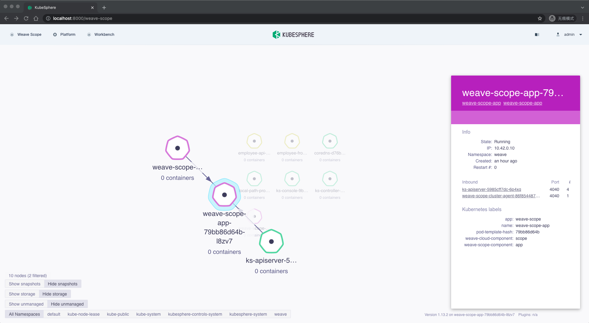

本章以将 Weave Scope 集成到扩展组件为例，带大家熟悉如何快速集成已有 Web UI 的第三方工具与系统。

[Weave Scope](https://github.com/weaveworks/scope) 可以自动生成应用程序的映射，使您能够直观地理解、监视和控制基于容器化微服务的应用程序。

### 部署 Weave Scope

您可以参考该文档[部署 Weave Scope](https://www.weave.works/docs/scope/latest/installing)，或通过以下命令在 K8s 集群中一键部署。

```bash
kubectl apply -f https://raw.githubusercontent.com/kubesphere/extension-samples/master/extensions-backend/weave-scope/manifests.yaml
```

### 为 Weave Scope 创建反向代理

```bash
kubectl apply -f https://raw.githubusercontent.com/kubesphere/extension-samples/master/extensions-backend/weave-scope/weave-scope-reverse-proxy.yaml
```

### 前端扩展组件开发

项目的创建、本地开发、调试流程，与[员工管理扩展组件示例](../employee-management-extension-example/#前端扩展组件开发)相同。您可以从 GitHub 上克隆本示例的代码

```bash
cd  ~/kubesphere-extensions
git clone https://github.com/kubesphere/extension-samples.git
cp -r ~/kubesphere-extensions/extension-samples/extensions-frontend/extensions/weave-scope ~/kubesphere-extensions/frontend/extensions
```

我们着重来看一下如何将 Weave Scope 的页面集成进来。

文件路径： `~/kubesphere-extensions/frontend/extensions/weave-scope/src/App.jsx`

```jsx
import React, { useState, useRef } from 'react';
import { get } from 'lodash';
import { Loading } from '@kubed/components';
import { useLocalStorage } from '@kubed/hooks';

export default function App() {
  const [loading, setLoading] = useState(true);

  const FRAME_URL =
    '/proxy/weave.works/#!/state/{"topologyId":"pods"}';

  const iframeRef = useRef();

  const onIframeLoad = () => {
    const iframeDom = get(iframeRef.current, 'contentWindow.document');
    if (iframeDom) {
      if (iframeDom.querySelector('#app > div > div.header > div')) {
        iframeDom.querySelector('#app > div > div.header > div').style.display = 'none';
      }
    }
    setLoading(false);
  };

  return (
    <>
      {loading && <Loading className="page-loading" />}
      <iframe
        ref={iframeRef}
        src={FRAME_URL}
        width="100%"
        height="100%"
        frameBorder="0"
        style={{
          height: 'calc(100vh - 68px)',
          display: loading ? 'none' : 'block',
        }}
        onLoad={onIframeLoad}
      />
    </>
  );
}
```

以上代码主要做了 2 件事。

1. 将 Weave Scope 页面以 `iframe` 的形式嵌入到扩展组件中。`FRAME_URL` 为 Weave Scope 的反向代理地址，且与 KubeSphere 页面地址**同源**。

{}
由于浏览器的同源策略（Same-Origin Policy），如果第三方系统网页与 KubeSphere 前端网页不同源，我们将无法使用 JavaScript 对第三方系统 iframe 进行读取和操作。 因此，我们通常需要由后端将第三方系统的前端访问地址，处理成和 KubeSphere 前端访问地址同源（**同协议**、**同主机**、**同端口**）的地址。
{}

2. 调整 Weave Scope 页面的样式。同样由于是同源，扩展组件可以通过 `React` 的 `ref` 读取和操作 Weave Scope 页面（`iframe`）的 DOM ，从而调整页面的样式，将 selector 部分隐藏。

通过 `yarn dev` 启动本地预览环境，您可以通过扩展组件入口访问到以下页面

