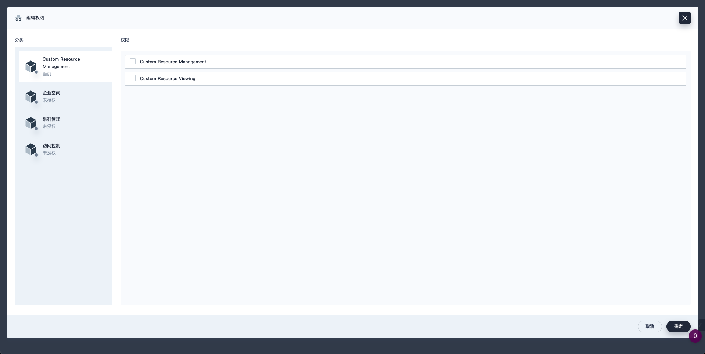

本章节介绍扩展组件如何对接 KubeSphere 访问控制。

## KubeSphere 中的访问控制

KubeSphere 是一个支持多租户的容器管理平台，与 Kubernetes 相同，KubeSphere 通过基于角色的访问控制（RBAC）对用户的权限加以控制，实现逻辑层面的资源隔离。

在 KubeSphere 中企业空间（Workspace）是最小的租户单元，企业空间提供了跨集群、跨项目（即 Kubernetes 中的命名空间）共享资源的能力。企业空间中的成员可以在授权集群中创建项目，并通过邀请授权的方式参与项目协同。

KubeSphere 中的资源被划分为平台、企业空间、集群、项目四个层级，所有的资源都会归属到这四个资源层级之中，各层级可以通过角色来控制用户的资源访问权限。

**平台角色：** 主要控制用户对平台资源的访问权限，如集群的管理、企业空间的管理、平台用户的管理等。

**企业空间角色：** 主要控制企业空间成员在企业空间下的资源访问权限，如企业空间下项目、企业空间成员的管理等。

**项目角色：** 主要控制项目下资源的访问权限，如工作负载的管理、流水线的管理、项目成员的管理等。


### KubeSphere API

[KubeSphere API](../../references/kubesphere-api-concepts/) 和 [Kubernertes API](https://kubernetes.io/zh-cn/docs/reference/using-api/api-concepts/) 的设计模式相同 是通过 HTTP 提供的基于资源 (RESTful) 的编程接口。
它支持通过标准 HTTP 动词（POST、PUT、PATCH、DELETE、GET）检索、创建、更新和删除主要资源。

对于某些资源，API 包括额外的子资源，允许细粒度授权（例如：将 Pod 的详细信息与检索日志分开），
为了方便或者提高效率，可以以不同的表示形式接受和服务这些资源。

#### Kubernetes API 术语

Kubernetes 通常使用常见的 RESTful 术语来描述 API 概念：

* **资源类型（Resource Type）** 是 URL 中使用的名称（`pods`、`namespaces`、`services`）
* 所有资源类型都有一个具体的表示（它们的对象模式），称为 **类别（Kind）**
* 资源类型的实例的列表称为 **集合（Collection）**
* 资源类型的单个实例称为 **资源（Resource）**，通常也表示一个 **对象（Object）**
* 对于某些资源类型，API 包含一个或多个 **子资源（sub-resources）**，这些子资源表示为资源下的 URI 路径

大多数 Kubernetes API
资源类型都是[对象](/zh-cn/docs/concepts/overview/working-with-objects/kubernetes-objects/#kubernetes-objects)：
它们代表集群上某个概念的具体实例，例如 Pod 或名字空间。
少数 API 资源类型是 “虚拟的”，它们通常代表的是操作而非对象本身，
例如权限检查（使用带有 JSON 编码的 `SubjectAccessReview` 主体的 POST 到 `subjectaccessreviews` 资源），
或 Pod 的子资源 `eviction`（用于触发 [API-发起的驱逐](/zh-cn/docs/concepts/scheduling-eviction/api-eviction/)）。

##### 对象名字

你可以通过 API 创建的所有对象都有一个唯一的名字，以允许幂等创建和检索，但如果虚拟资源类型不可检索或不依赖幂等性，则它们可能没有唯一名称。
在名字空间内，同一时刻只能有一个给定类别的对象具有给定名称。但是，如果你删除该对象，你可以创建一个具有相同名称的新对象。有些对象没有名字空间（例如：节点），因此它们的名称在整个集群中必须是唯一的。

#### API 动词

几乎所有对象资源类型都支持标准 HTTP 动词 - GET、POST、PUT、PATCH 和 DELETE。
Kubernetes 也使用自己的动词，这些动词通常写成小写，以区别于 HTTP 动词。

Kubernetes 使用术语 **list** 来描述返回资源集合，
以区别于通常称为 **get** 的单个资源检索。
如果你发送带有 `?watch` 查询参数的 HTTP GET 请求，
Kubernetes 将其称为 **watch** 而不是 **get**。

对于 PUT 请求，Kubernetes 在内部根据现有对象的状态将它们分类为 **create** 或 **update**。
**update** 不同于 **patch**；**patch** 的 HTTP 动词是 PATCH。

#### 资源 URI

资源类型可以是：

平台作用域的 （`(apis/kapis)/GROUP/VERSION/*`）

集群作用域的（`/clusters/CLUSTER/(apis/kapis)/GROUP/VERSION/*`）

企业空间作用域的 （`(apis/kapis)/GROUP/VERSION/workspaces/WORKSPACE/*`）

名字空间作用域的（`/clusters/CLUSTER/(apis/kapis)/GROUP/VERSION/namespaces/NAMESPACE/*`）

注意： KubeSphere 支持 K8s 多集群纳管。只要在请求路径之前添加集群标识作为前缀，就可以通过 API 直接访问 member 集群。Kubernetes 核心资源使用 `/api` 而不是 `/apis`，并且不包含 GROUP 路径段。

示例：

* `/apis/iam.kubesphere.io/v1beta1/users`
* `/apis/cluster.kubesphere.io/v1alpha2/clusters`
* `/cluster/host/api/v1/pods`
* `/kapis/iam.kubesphere.io/v1beta1/workspaces/my-workspace/devopsprojects`
* `/cluster/host/api/v1/namespaces/my-namespace/pods`

### RBAC

基于角色（Role）的访问控制（RBAC）是一种基于组织中用户的角色来调节控制对计算机或网络资源的访问的方法。

RBAC 鉴权机制使用 `iam.kubesphere.io` 来驱动鉴权决定，允许你通过 KubeSphere API 动态配置策略。

RBAC API 声明了八种 CRD 对象：**Role**、**ClusterRole**、**GlobalRole**、**WorkspaceRole**、**RoleBinding** 、
**ClusterRoleBinding**、**GlobalRoleBinding** 和 **WorkspaceRoleBinding**

RBAC 的 **Role**、**ClusterRole**、**GlobalRole**、**WorkspaceRole** 中包含一组代表相关权限的规则。
这些权限是纯粹累加的（不存在拒绝某操作的规则）。

Role 用于限制名字空间作用域资源的访问权限；
ClusterRole 用于限制集群作用域的资源资源访问权限；
WorkspaceRole 用于限制企业空间作用域的资源访问权限；
GlobalRole 用于限制平台作用域的资源资源访问权限；

下面是一个位于 "default" 名字空间的 Role 的示例，可用来授予对 Pod 的读访问权限：

```yaml
apiVersion: iam.kubesphere.io/v1beta1
kind: Role
metadata:
  namespace: default
  name: pod-reader
rules:
- apiGroups: [""]
  resources: ["pods"]
  verbs: ["get", "watch", "list"]
```

下面的例子中的 RoleBinding 将 "pod-reader" Role 授予在 "default" 名字空间中的用户 "jane"。
这样，用户 "jane" 就具有了读取 "default" 名字空间中所有 Pod 的权限。

```yaml
apiVersion: iam.kubesphere.io/v1beta1
# 此角色绑定允许 "jane" 读取 "default" 名字空间中的 Pod
# 你需要在该名字空间中有一个名为 “pod-reader” 的 Role
kind: RoleBinding
metadata:
  name: read-pods
  namespace: default
subjects:
# 你可以指定不止一个“subject（主体）”
- kind: User
  name: jane # "name" 是区分大小写的
  apiGroup: iam.kubesphere.io
roleRef:
  # "roleRef" 指定与某 Role 或 ClusterRole 的绑定关系
  kind: Role        # 此字段必须是 Role 或 ClusterRole
  name: pod-reader  # 此字段必须与你要绑定的 Role 或 ClusterRole 的名称匹配
  apiGroup: iam.kubesphere.io
```

## 自定义授权项

KubeSphere 中可以通过授权项灵活的创建自定义角色，做到精细的访问控制。

### RoleTemplate

`RoleTemplate` 是由 KubeSphere 提供的 CRD， 用于声明权限项，是 KubeSphere UI 中最小的权限分割单元，通常用来定义某一类型资源的访问权限。在各资源层级中的角色都由权限组合而成，基于权限项，我们可以灵活的创建出自定义角色，做到精细的访问控制。

在 Kubesphere 用户界面中，我们通常在获得一个资源时，同时也希望获得这个资源相关联的其他资源。我们把一组关联紧密的资源的权限放在一个 RoleTemplate 中，以满足在用户界面操作的使用需求。

**平台角色权限项：**


**企业空间角色权限项：**


**集群角色权限项：**


**项目角色权限项：**


### RoleTemplate 示例

假设扩展组件中定义了 CRD `custom-resource` `custom-resource-version`。我们期望 KubeSphere 用户在用户界面查看 custom-resource 时能够同时返回 custom-resource-version, 以下 YAML 文件创建了 `global-custom-resource-viewing` 和 `global-custom-resource-creation` 两个自定义权限，分别授权用户查看和创建 `custom-resource` 类型的资源，其中 `global-custom-resource-creation` 依赖于 `global-custom-resource-viewing`。

```yaml
apiVersion: iam.kubesphere.io/v1beta1
kind: RoleTemplate
metadata:
  name: global-custom-resource-view
  labels:
    iam.kubesphere.io/category: custom-resource-management
    iam.kubesphere.io/scope: global
    kubesphere.io/managed: 'true'
spec:
  displayName:
    en: Custom Resource Viewing
  rules:
    - apiGroups:
        - custom-api-group
      resources:
        - custom-resource
        - custom-resource-version
      verbs:
        - list
        - get
        - watch

---
apiVersion: iam.kubesphere.io/v1beta1
kind: RoleTemplate
metadata:
  name: global-custom-resource-manage
  annotations:
    iam.kubesphere.io/dependencies: global-custom-resource-view
  labels:
    iam.kubesphere.io/category: custom-resource-management
    iam.kubesphere.io/scope: global
    kubesphere.io/managed: 'true'
spec:
  displayName:
    en: Custom Resource Management
  rules:
    - apiGroups:
        - custom-api-group
      resources:
        - custom-resource
        - custom-resource-version
      verbs:
        - '*'
```

#### RoleTemplate 参数说明

以下介绍如何设置自定义权限的参数。

* `apiVersion`：KubeSphere 访问控制 API 的版本。当前版本为 `iam.kubesphere.io/v1beta1`。
* `kind`：自定义权限的资源类型。请将参数值设置为 `RoleTemplate`。
* `metadata`：自定义权限的元数据。
  * `name`：自定义权限的资源名称。
  * `annotations`：
    * `iam.kubesphere.io/dependencies`: 在 Console 中会显示为依赖关系，当选中这个权限项时会自动选中依赖的权限项。
    * `iam.kubesphere.io/role-template-rules`: 具体控制 Console 权限规则，相见下文 Console 前端权限控制。
  * `labels`：
    * `iam.kubesphere.io/scope`：自定义权限的资源标签。KubeSphere 将权限分为平台、集群、企业空间和项目权限。取值 `global` 表示当前权限为平台级别的权限。可选的值有 `global`、`cluster`、`workspace` 和 `namespace`。
    * `iam.kubespere.io/category`：标记权限项所属的类别。
    * `iam.kubespere.io/managed`：KubeSphere 管理的授权项。
* `spec`
  * `displayName`：显示名称，支持国际化
    * `en`：英文显示名称。
    * `zh`：中文显示名称。
  * `rules`：自定义权限向用户授权的资源和操作。此参数为自定义权限内容的实际定义。
    * `apiGroups`：向用户授权的资源类型所属的 API 组。取值 `'*'` 表示当前权限级别的所有 API 组。
    * `resources`：向用户授权的资源类型，可以为 CRD（例如本节示例中的 `custom-resource`，`custom-resource-version`）或 Kubernetes 默认资源类型（例如 `deployment`）。取值 `'*'` 表示当前权限级别的所有资源类型。
    * `verbs`：向用户授权的操作。取值 `'*'` 当前权限级别的所有操作。有关资源操作类型的更多信息，请参阅 [Kubernetes 官方文档](https://kubernetes.io/docs/reference/access-authn-authz/authorization/)。

### Category

Category 用于标记 RoleTemplate 所属的类别。KubeSphere Console 将根据权限项的类别将权限项分组显示。对应 RoleTemplate 的 label `iam.kubesphere.io/category: custom-resource-management`。

```yaml
apiVersion: iam.kubesphere.io/v1beta1
kind: Category
metadata:
  name: custom-resource-management
  labels:
    iam.kubesphere.io/scope: global
    kubesphere.io/managed: 'true'  
spec:
  displayName:        
    en: Custom Resource Management
```

#### Category 参数说明

* `apiVersion`：KubeSphere 访问控制 API 的版本。当前版本为 `iam.kubesphere.io/v1beta1`。
* `kind`：自定义权限的资源类型。请将参数值设置为 `Category`。
* `metadata`：自定义权限的元数据。
  * `name`：自定义权限的资源名称。
  * `labels`：
    * `iam.kubesphere.io/scope`：自定义权限的资源标签。KubeSphere 将权限分为平台、集群、企业空间和项目权限。取值 `global` 表示当前权限为平台级别的权限。可选的值有 `global`、`cluster`、`workspace` 和 `namespace`。
    * `spec`
      * `displayName`：显示名称，支持国际化
        * `en`：英文显示名称。
        * `zh`：中文显示名称。

### 自定义角色创建

声明 RoleTemplate、Category 后，自定义角色的创建：



## Console 前端权限控制
  
menu 权限设置

```JavaScript
// menu 涉及权限字段
const menu = { 
  name: 'hello-world',     // name 必填字段
  ksModule: 'hello-world',    
  authKey: 'hello-world',  
  authAction:'view',   
  skipAuth: true,      
};
```

权限过滤效果

|   | 权限                         | 字段                  | 类型        | 说明                                 |
|---|----------------------------|---------------------|-----------|------------------------------------|
| 1 | 是否为平台管理员角色(platform-admin) | `admin`             | `boolean` | 为 `true` 则非平台管理员不显示, 默认值 `false`   |
| 2 | 根据模块是否在当前集群中安装过滤           | `clusterModule`     | `string`  | 在当前集群中未安装不显示,可以指定多个模块使用 `\|` 进行分割  |
| 3 | 根据模块是否安装过滤                 | `ksModule`          | `string`  | 未安装模块不显示                           |
| 4 | 根据配置权限过滤                   | `authKey` or `name` | `string`  | 有 `authKey` 取 `authKey`，否则取 `name` |
| 5 | 根据配置权限项                    | `authAction`        | `string`  | 默认值 `view`                         |
| 6 | 跳过权限控制                     | `skipAuth`          | `boolean` | 优先级最高，为 `true` 则忽略其他配置             |

* RoleTemplate 前端权限控制

```yaml
metadata:
  annotations:
    iam.kubesphere.io/role-template-rules: '{"pipelines":"view"}'
    iam.kubesphere.io/role-template-rules: '{"pipelines":"manage"}'
```

* RoleTemplate 前端权限控制参数说明
  * `iam.kubesphere.io/role-template-rules`：控制前端权限的注解， `{key: action }` 格式 JSON 字符串。
  * `{key}`：前端权限的 key，对应前端权限的 `authKey` 或 `name` 字段。
  * `{action}`: 见 RoleTemplate 前端权限控制 action。

* RoleTemplate 前端权限控制 action
  * `view`：有此字段，会显示对应的菜单和页面。但只有查看权限，没有操作权限。
  * `*`、`manage`：有完整查看和操作权限。
  * `create`: 有创建权限。
  * `delete`: 有删除权限。
  * `edit`: 有编辑权限。
  * 其他自定义值（配合前端硬编码）。

  > 注：`create`、`delete`、`edit` 为前端权限，需配合前端代码，在对应操作的按钮上添加类似 `action: 'create'` 代码，下例。

```JavaScript
import { useActionMenu, DataTable } from '@ks-console/shared';
const renderTableAction = useActionMenu({
  autoSingleButton: true,
  authKey,
  params,
  actions: [
    {
      key: 'invite',
      text: t('INVITE'),
      action: 'create',  //此处为具体 action 
      props: {
        color: 'secondary',
        shadow: true,
      },
      onClick: openCreate,
    },
  ],
});
return (<DataTable 
  // ... the other props
  toolbarRight={renderTableAction({})}
/>)
```
