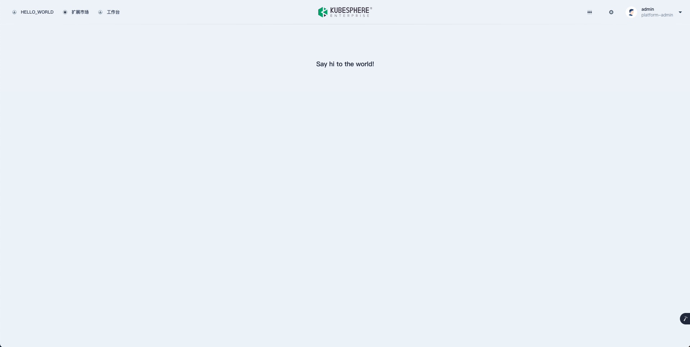

### JSBundle

与开发模式不同，以生产模式运行的 ks-console 无法直接从本地加载您开发的功能页面。因此，在完成前端功能开发后，需要将前端代码打包，并通过 **JSBundle** 资源声明将您的 UI 扩展包注入到 ks-console 中。

在前端工程目录下，使用 `yarn build:ext <extension>` 打包前端扩展，扩展组件源代码目录下会生成 `dist/index.js` 文件。

```bash
➜  extensions-frontend git:(master) ✗ yarn build:ext example
yarn run v1.22.19
$ ksc build:ext example
Browserslist: caniuse-lite is outdated. Please run:
  npx update-browserslist-db@latest
  Why you should do it regularly: https://github.com/browserslist/update-db#readme
asset index.js 15.2 KiB [emitted] [minimized] (name: index)
webpack 5.74.0 compiled successfully in 816 ms

  Webpack Finished

✨  Done in 2.59s.
```


JSBundle 示例：

```yaml
apiVersion: extensions.kubesphere.io/v1alpha1
kind: JSBundle
metadata:
  name: v1alpha1.example.kubesphere.io
spec:
  rawFrom:
    url: http://example-frontend.extension-example.svc/dist/employee-frontend/index.js
  # configMapKeyRef:
  #   name: example
  #   key: index.js
  #   namespace: extension-employee
  # secretKeyRef:
  #   name: example
  #   key: index.js
  #   namespace: extension-employee
status:
  # 默认生成的静态文件地址格式为 /dist/{extensionName}/index.js
  # 静态文件的访问地址可以被手动指定为 /dist/{extensionName}/{subPath}/{fileName}
  link: /dist/v1alpha1.example.kubesphere.io/index.js 
  state: Available
```

| 字段 | 描述 |
| --- | ---|
| `spec.raw`</br>`spec.rawFrom.configMapKeyRef`</br>`spec.rawFrom.secretKeyRef` | 为便于开发，体积较小的 js 文件可以直接在自定义资源 (CR) 中定义或者直接嵌入到 ConfigMap 或 Secret 中|
| `spec.rawFrom.url` | 体积较大的 js 文件则需要通过额外的后端服务来提供，扩展组件被启用后，`ks-console` 会自动注入该扩展包|

打包后体积较小的 js 文件，可以借助 ConfigMap 或 Secret 来保存，并通过 `spec.configMapKeyRef`、`spec.secretKeyRef` 进行引用。

打包后体积较大的 js 文件，则需要通过 HTTP 服务来提供对应的 js 文件，并使用 `spec.rawFrom.url` 指定 js 文件的访问路径，通常可以和后端共用一个服务。

### 测试

在完成扩展组件前端代码的打包之后，可以手动创建 JSBundle，以 production 模式启动 KubeSphere Console 进行测试。

**dist/index.js**：

```js
System.register(["react","styled-components"],(function(e,t){var r={},n={};return{setters:[function(e){r.default=e.default},function(e){n.default=e.default}],execute:function(){e(function(){var e={354:function(e,t,r){var n={"./base.json":197};function o(e){var t=i(e);return r(t)}function i(e){if(!r.o(n,e)){var t=new Error("Cannot find module '"+e+"'");throw t.code="MODULE_NOT_FOUND",t}return n[e]}o.keys=function(){return Object.keys(n)},o.resolve=i,e.exports=o,o.id=354},882:function(e,t,r){var n={"./base.json":881};function o(e){var t=i(e);return r(t)}function i(e){if(!r.o(n,e)){var t=new Error("Cannot find module '"+e+"'");throw t.code="MODULE_NOT_FOUND",t}return n[e]}o.keys=function(){return Object.keys(n)},o.resolve=i,e.exports=o,o.id=882},386:function(e,t,r){var n=r(149).R;t.s=function(e){if(e||(e=1),!r.y.meta||!r.y.meta.url)throw console.error("__system_context__",r.y),Error("systemjs-webpack-interop was provided an unknown SystemJS context. Expected context.meta.url, but none was provided");r.p=n(r.y.meta.url,e)}},149:function(e,t,r){function n(e,t){var r=document.createElement("a");r.href=e;for(var n="/"===r.pathname[0]?r.pathname:"/"+r.pathname,o=0,i=n.length;o!==t&&i>=0;){"/"===n[--i]&&o++}if(o!==t)throw Error("systemjs-webpack-interop: rootDirectoryLevel ("+t+") is greater than the number of directories ("+o+") in the URL path "+e);var c=n.slice(0,i+1);return r.protocol+"//"+r.host+c}t.R=n;var o=Number.isInteger||function(e){return"number"==typeof e&&isFinite(e)&&Math.floor(e)===e}},954:function(e){"use strict";e.exports=r},205:function(e){"use strict";e.exports=n},197:function(e){"use strict";e.exports={name:"Name"}},881:function(e){"use strict";e.exports={name:"名称"}}},o={};function i(t){var r=o[t];if(void 0!==r)return r.exports;var n=o[t]={exports:{}};return e[t](n,n.exports,i),n.exports}i.y=t,i.g=function(){if("object"==typeof globalThis)return globalThis;try{return this||new Function("return this")()}catch(e){if("object"==typeof window)return window}}(),i.o=function(e,t){return Object.prototype.hasOwnProperty.call(e,t)},i.r=function(e){"undefined"!=typeof Symbol&&Symbol.toStringTag&&Object.defineProperty(e,Symbol.toStringTag,{value:"Module"}),Object.defineProperty(e,"__esModule",{value:!0})},function(){var e;i.g.importScripts&&(e=i.g.location+"");var t=i.g.document;if(!e&&t&&(t.currentScript&&(e=t.currentScript.src),!e)){var r=t.getElementsByTagName("script");r.length&&(e=r[r.length-1].src)}if(!e)throw new Error("Automatic publicPath is not supported in this browser");e=e.replace(/#.*$/,"").replace(/\?.*$/,"").replace(/\/[^\/]+$/,"/"),i.p=e}();var c={};return(0,i(386).s)(1),function(){"use strict";i.r(c);var e=i(954),t=i(205).default.h3.withConfig({displayName:"App__Wrapper",componentId:"sc-1bs6lxk-0"})(["margin:8rem auto;text-align:center;"]);function r(){return e.default.createElement(t,null,"Say hi to the world!")}var n=[{path:"/hello-world",element:e.default.createElement(r,null)}];function o(e,t,r){return t in e?Object.defineProperty(e,t,{value:r,enumerable:!0,configurable:!0,writable:!0}):e[t]=r,e}function u(e,t){var r=Object.keys(e);if(Object.getOwnPropertySymbols){var n=Object.getOwnPropertySymbols(e);t&&(n=n.filter((function(t){return Object.getOwnPropertyDescriptor(e,t).enumerable}))),r.push.apply(r,n)}return r}function a(e){for(var t=1;t<arguments.length;t++){var r=null!=arguments[t]?arguments[t]:{};t%2?u(Object(r),!0).forEach((function(t){o(e,t,r[t])})):Object.getOwnPropertyDescriptors?Object.defineProperties(e,Object.getOwnPropertyDescriptors(r)):u(Object(r)).forEach((function(t){Object.defineProperty(e,t,Object.getOwnPropertyDescriptor(r,t))}))}return e}for(var s=i(882),f=s.keys().filter((function(e){return"./index.ts"!==e})),l={},p=0;p<f.length;p+=1)f[p].startsWith(".")&&(l=a(a({},l),s(f[p])));var b=l;function y(e,t){var r=Object.keys(e);if(Object.getOwnPropertySymbols){var n=Object.getOwnPropertySymbols(e);t&&(n=n.filter((function(t){return Object.getOwnPropertyDescriptor(e,t).enumerable}))),r.push.apply(r,n)}return r}function d(e){for(var t=1;t<arguments.length;t++){var r=null!=arguments[t]?arguments[t]:{};t%2?y(Object(r),!0).forEach((function(t){o(e,t,r[t])})):Object.getOwnPropertyDescriptors?Object.defineProperties(e,Object.getOwnPropertyDescriptors(r)):y(Object(r)).forEach((function(t){Object.defineProperty(e,t,Object.getOwnPropertyDescriptor(r,t))}))}return e}for(var h=i(354),O=h.keys().filter((function(e){return"./index.ts"!==e})),m={},v=0;v<O.length;v+=1)O[v].startsWith(".")&&(m=d(d({},m),h(O[v])));var g={routes:n,menus:[{parent:"topbar",name:"hello-world",title:"HELLO_WORLD",icon:"cluster",order:0,desc:"Say hi to the world!",skipAuth:!0}],locales:{zh:b,en:m}};globals.context.registerExtension(g)}(),c}())}}}));
```

创建 ConfigMap 保存 index.js

```bash
kubectl create configmap test --from-file=dist/index.js
configmap/test created
```

创建 JSBundle

```bash
cat << EOF | kubectl apply -f -
apiVersion: extensions.kubesphere.io/v1alpha1
kind: JSBundle
metadata:
  name: test
spec:
  rawFrom:
    configMapKeyRef:
      key: index.js
      name: test
      namespace: default # 需要与 configmap 的 namespace 一致
status:
  link: /dist/test/index.js
  state: Available
EOF
```

本地通过 `yarn start` 以 production 模式启动 KubeSphere Console 加载远端的扩展组件

