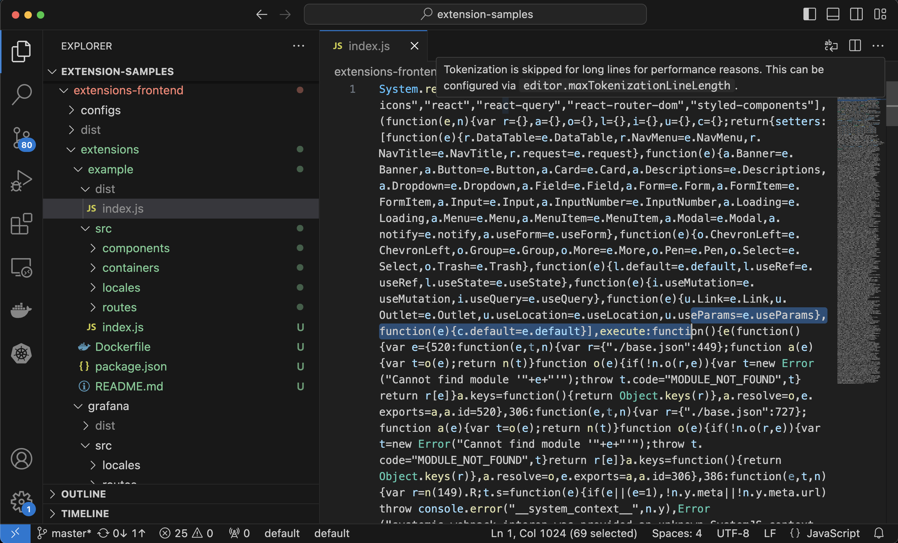

## UI 扩展

与开发模式不同，以生产模式运行的 ks-console 无法直接从本地加载您开发的功能页面。因此，在完成前端功能开发后，需要将前端代码打包，并通过 **JSBundle** 资源声明将您的 UI 扩展包注入到 ks-console 中。

在前端工程目录下，使用 `yarn build:ext <extension>` 打包前端扩展，扩展组件源代码目录下会生成 `dist/index.js` 文件。

```bash
➜  extensions-frontend git:(master) ✗ yarn build:ext example
yarn run v1.22.19
$ ksc build:ext example
Browserslist: caniuse-lite is outdated. Please run:
  npx update-browserslist-db@latest
  Why you should do it regularly: https://github.com/browserslist/update-db#readme
asset index.js 15.2 KiB [emitted] [minimized] (name: index)
webpack 5.74.0 compiled successfully in 816 ms

  Webpack Finished

✨  Done in 2.59s.
```



JSBundle 示例：

```yaml
apiVersion: extensions.kubesphere.io/v1alpha1
kind: JSBundle
metadata:
  name: v1alpha1.example.kubesphere.io
spec:
  rawFrom:
    url: http://example-frontend.extension-example.svc/dist/employee-frontend/index.js
  # configMapKeyRef:
  #   name: example
  #   key: index.js
  #   namespace: extension-employee
  # secretKeyRef:
  #   name: example
  #   key: index.js
  #   namespace: extension-employee
```

| 字段 | 描述 |
| --- | ---|
| `spec.raw`</br>`spec.rawFrom.configMapKeyRef`</br>`spec.rawFrom.secretKeyRef` | 为便于开发，体积较小的 js 文件可以直接在自定义资源 (CR) 中定义或者直接嵌入到 ConfigMap 或 Secret 中|
| `spec.rawFrom.url` | 体积较大的 js 文件则需要通过额外的后端服务来提供，扩展组件被启用后，`ks-console` 会自动注入该扩展包|

打包后体积较小的 js 文件，可以借助 ConfigMap 或 Secret 来保存，并通过 `spec.configMapKeyRef`、`spec.secretKeyRef` 进行引用。

打包后体积较大的 js 文件，则需要通过 HTTP 服务来提供对应的 js 文件，并使用 `spec.rawFrom.url` 指定 js 文件的访问路径，通常可以和后端共用一个服务。
