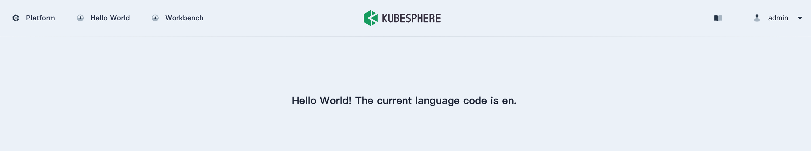

本章节介绍如何实现扩展组件前端页面的国际化。

KubeSphere Core 集成了 [i18next](https://www.i18next.com/) 作为国际化组件，支持通过自定义语言包实现扩展组件前端多语言显示。

## 语言包

扩展组件前端模块中的 `src/locales` 目录用于存放扩展组件的语言包。默认情况下，它包括英文语言包 `en` 和简体中文语言包 `zh`，还可以根据需要手动创建其他语言包。前端界面的词条通常保存在 JSON 文件中，支持在每个语言包中创建多个 JSON 文件。

```shell
kubesphere-extensions
└── frontend
    └── extensions
        └── hello-world
            └── src
                └── locales
                    ├── en
                    │   ├── base.json
                    │   └── index.js
                    ├── index.js
                    └── zh
                        ├── base.json
                        └── index.js
```

## 开发步骤

下面以 [Hello World](../../quickstart/hello-world-extension/) 扩展组件为例，演示如何在扩展组件前端分别显示英文词条 `Hello World! The current language code is {languageCode}.` 和中文词条`你好世界！当前的语言代码为 {languageCode}。`，并向 `{languageCode}` 变量动态传入当前环境的语言代码。

1. 在 `src/locales/en/base.json` 文件和 `src/locales/zh/base.json` 文件中分别添加以下词条：

   ```json
   // src/locales/en/base.json
   {
     "HELLO_WORLD_DESC": "Hello World! The current language code is {languageCode}."
   }
   ```

   ```json
   // src/locales/zh/base.json
   {
     "HELLO_WORLD_DESC": "你好世界！当前的语言代码为 {languageCode}。"
   }
   ```

2. 在扩展组件的入口文件（例如 `src/index.js` ）中引入语言包：

   ```js
   import routes from './routes';
   import locales from './locales';  // 引入语言包

   onst menu = {
     parent: 'topbar',
     name: 'hello-world',
     link: '/hello-world',
     title: 'HELLO_WORLD',
     icon: 'cluster',
     order: 0,
     desc: 'HELLO_WORLD_DESC',
     skipAuth: true,
   };

   const extensionConfig = {
     routes,
     menus: [menu],
     locales,
   };

   globals.context.registerExtension(extensionConfig);
   ```

3. 在扩展组件前端开发过程中，使用全局函数 `t()` 获取词条内容并向变量传入动态值。例如，在 `src/App.jsx` 文件中编写以下代码：

   ```jsx
   export default function App() {
     return <Wrapper>{t('HELLO_WORLD_DESC', {languageCode: globals.user.lang})}</Wrapper>;
   }
   ```

4. 在 `frontend` 目录下执行 `yarn dev` 命令启动前端环境。

5. 访问 `http://localhost:8000` 并登录，在页面右上角点击当前用户的名称，然后选择`用户设置`切换语言。

   在 `English` 和`简体中文`语言环境下点击 `Hello World` 将分别显示以下文字：

   

   
