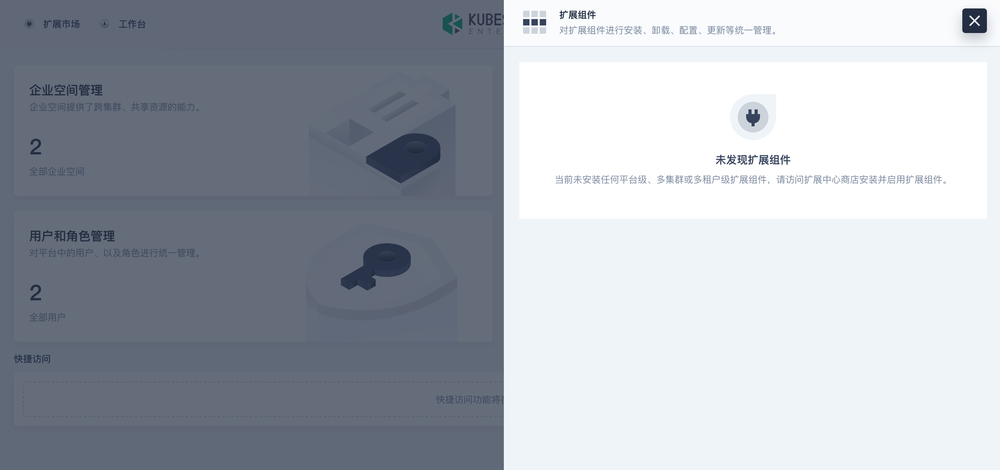
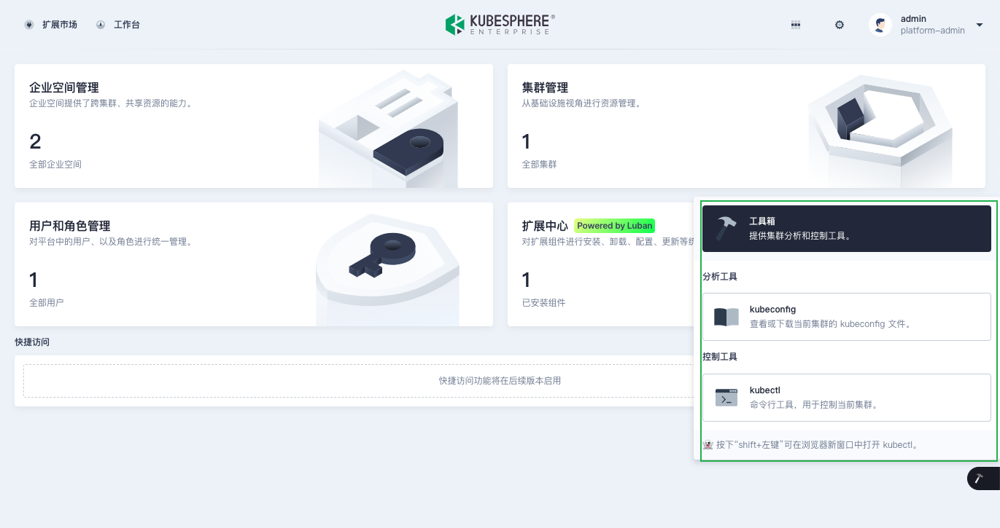

本章节介绍如何设置扩展组件在 KubeSphere Web 控制台的挂载位置。

### 可选挂载位置

您可以将扩展组件挂载到以下位置：

* 顶部菜单栏

  

* 扩展组件菜单

  在顶部菜单栏点击  图标打开菜单。

  

* 工具箱菜单

  将光标悬停在页面右下角的  图标打开菜单。

  

* 左侧导航栏
  
  KubeSphere 在访问控制、集群管理、企业空间管理、项目管理和平台设置页面提供左侧导航栏。例如，集群管理页面的左侧导航栏如下图所示：

  

### 设置挂载位置

您可以在扩展组件前端源代码入口文件（例如 `src/index.js`）中的 `menu` 对象设置挂载位置，例如：

```javascript
const menu = { 
  parent: 'global',
  name: 'hello-world',
  link: '/hellow-world',
  title: 'HELLO_WORLD',
  icon: 'cluster',
  order: 0,
  desc: 'HELLO_WORLD_DESC',
  skipAuth: true,
};
```

<table>
  <colsgroup>
    <col style="width: 25%;">
    <col style="width: 75%;">
  </colsgroup>
  <thead>
    <tr>
      <th>参数</th>
      <th>描述</th>
    </tr>
  <thead>
  <tbody>
    <tr>
      <td>parent</td>
      <td>扩展组件的挂载位置，取值可以为：
        <ul>
          <li><strong>topbar</strong>：挂载到顶部菜单栏。</li>
          <li><strong>global</strong>：挂载到扩展组件菜单。</li>
          <li><strong>toolbox</strong>：挂载到工具箱菜单。</li>
          <li><strong>access</strong>：挂载到访问控制页面左侧导航栏。</li>
          <li><strong>cluster</strong>：挂载到集群管理页面左侧导航栏。</li>
          <li><strong>workspace</strong>：挂载到企业空间管理页面左侧导航栏。</li>
          <li><strong>project</strong>：挂载到项目管理页面左侧导航栏。</li>
          <li><strong>platformSettings</strong>：挂载到平台设置页面左侧导航栏。</li>
        </ul>
      </td>
    </tr>
    <tr>
      <td>name</td>
      <td>扩展组件在菜单上的位置标识。</td>
    </tr>
    <tr>
      <td>link</td><td>扩展组件的跳转路径。目前仅对 <code>parent</code> 取值为 <code>global</code> 和 <code>topbar</code> 时有效。</td>
    </tr>
    <tr>
      <td>title</td><td>扩展组件在菜单上显示的名称。请勿直接将参数值设置为硬编码的字符串，建议将参数值设置为词条的键，并通过 KubeSphere 提供的国际化接口实现多语言。有关更多信息，请参阅<a href="../internationalization">国际化</a>。</td>
    </tr>
    <tr>
      <td>icon</td><td>扩展组件在菜单上显示的图标的名称。</td>
    </tr>
    <tr>
      <td>order</td><td>扩展组件在菜单上的排列位次，取值为 <code>0</code> 或正整数，取值 <code>0</code> 表示扩展组件在菜单首位。</td>
    </tr>
    <tr>
      <td>desc</td><td>扩展组件在菜单上显示的描述文字，目前仅对 <code>parent</code> 取值为 <code>global</code> 和 <code>toolbox</code> 时有效。请勿直接将参数值设置为硬编码的字符串，建议将参数值设置为词条的键，并通过 KubeSphere 提供的国际化接口实现多语言。有关更多信息，请参阅<a href="../internationalization">国际化</a>。</td>
    </tr>
    <tr>
      <td>skipAuth</td><td>是否跳过用户权限检查。有关更多信息，请参阅<a href="../access-control">访问控制</a>。</td>
    </tr>
  </tbody>
</table>

