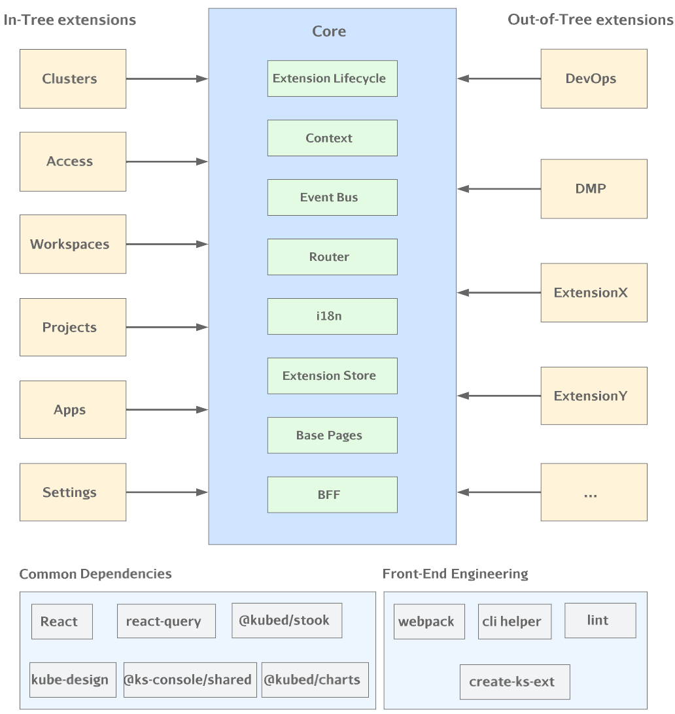

为了使 KubeSphere 更加灵活和可扩展，我们采用了`微内核+扩展组件`的架构。在这个架构中，`微内核`部分仅包含系统运行所需的基础功能，而各个独立的业务模块则被封装在各个扩展组件中。这使系统能够在运行时动态地安装、卸载、启用或禁用这些扩展组件。总体架构如下图所示：



## 设计思想

在解耦巨石应用和实现动态扩展时，我们不可避免地会考虑到近年来备受欢迎的`微前端`解决方案。著名的微前端实现，如 qiankun 和 micro-app，为了应对子应用的技术栈独立性和样式侵入问题，采取了大量措施，包括实施 JavaScript 沙箱和样式隔离等。然而，这种隔离通常是为了解决特定技术栈问题或团队协作问题而做出的妥协。如果将多个框架，如 React、Vue 和 Angular，融合到同一前端系统中，可能会面临一致的用户界面体验挑战，而前端包的大小也可能显著增加。此外，各个子应用在各自独立的运行时中运行，可能与主应用的集成度不够紧密。

在这一背景下，我们希望减少隔离的需求，实现更轻量级的"微前端"，或者我们可以称之为`微模块`。在微模块架构中，子应用和主应用共享相同的技术栈，并能够共享运行时。这有助于实现更一致的用户体验、更高的集成度和更便捷的依赖共享，从而提高运行效率。正如上面的架构图所示，扩展组件的开发依赖于通用的 [KubeDesign](https://github.com/kubesphere/kube-design)、[@ks-console/shared](https://www.npmjs.com/package/@ks-console/shared) 等库。然后，可以使用[脚手架](https://github.com/kubesphere/create-ks-project)、CLI 等工具进行打包和发布。在 Core（基座）的部分实现了扩展组件的注册和运行。

## 内核

如上面架构图所示，内核的功能主要包括：

1. 扩展组件的管理

   扩展组件的管理涉及两个重要方面，即在运行时完成扩展组件的 JavaScript bundle 加载以及扩展组件的注册。在 4.0 版本的架构中，采用了 SystemJS 来实现对扩展组件 JavaScript bundle 的加载。同时，制定了扩展组件的入口规范，以确保它们能够连接到核心系统并运行。

2. 通讯机制

   在内核中内置 EventBus（发布/订阅），以方便内核与扩展组件之间以及扩展组件之间的通信。

3. 路由管理

   基于 react-router，扩展组件定义的路由在扩展组件注册时会被统一管理到内核中。

4. 国际化

   我们采用 i18next 实现国际化。开发者可以在扩展组件中按照 i18next 的格式定义翻译文件，然后按照约定注册到内核中。

5. 扩展中心

   类似于 Chrome 浏览器的扩展程序，我们也提供了一个可视化的扩展组件管理模块，允许用户在页面上轻松执行扩展组件的安装、卸载、启用、禁用等操作。

6. 基础页面

   包括系统运行所需的一些基本 UI 元素，例如登录页面和页面布局。

7. BFF

   基于 Koa 实现的 BFF 层。主要负责首页渲染、请求转发、数据转换以及一些轻量级的后端任务。


## 扩展组件

如上面的架构图所示，扩展组件分为 `In-Tree 扩展组件` 和 `Out-of-Tree 扩展组件`。它们的区别在于：

* `In-Tree 扩展组件` 主要包括系统中不可或缺或常用的功能组件，这些组件会在编译时与 `core` 一同打包。目前，`In-Tree 扩展组件`包括：
   1. Cluster 集群管理
   2. Access 访问控制
   3. Workspaces 工作空间
   4. Projects 项目管理
   5. Apps 应用商店
   6. Settings 平台设置

* `Out-of-Tree 扩展组件` 是由开发者在自己的代码仓库中开发的扩展组件，需要独立进行编译和打包。这些组件将被发布到 `扩展市场`。用户安装后，内核会远程加载扩展组件的 `js bundle` 并将其注册到内核中。

`Out-of-Tree 扩展组件` 的前端部分统一使用 [create-ks-project](https://github.com/kubesphere/create-ks-project) 脚手架工具进行初始化。初始化后的目录结构如下：

```bash
.
├── babel.config.js
├── configs
│   ├── config.yaml
│   ├── console.config.js
│   └── local_config.yaml
├── extensions
│   ├── entry.ts
│   └── hello-world
│       ├── Dockerfile
│       ├── README.md
│       ├── package.json
│       └── src
│           ├── App.jsx
│           ├── index.js
│           ├── locales
│           │   ├── en
│           │   │   ├── base.json
│           │   │   └── index.js
│           │   ├── index.js
│           │   └── zh
│           │       ├── base.json
│           │       └── index.js
│           └── routes
│               └── index.js
├── node_modules
├── package.json
├── tsconfig.base.json
├── tsconfig.json
└── yarn.lock
```

可以看出这和普通的 react app 基本一样。不同点在于对 entry 的定义。示例如下：

```javascript
import routes from './routes';                   // 导入路由
import locales from './locales';                 // 导入国际化文件

const menu = {                                   // 定义菜单 
  parent: 'topbar',                              // 菜单父级
  name: 'hello-world',                           // 菜单 name 标识 
  link: '/hello-world',                          // 入口 url    
  title: 'Hello World',                          // 菜单名称  
  icon: 'cluster',                               // 菜单 icon
  order: 0,                                      // 菜单排序  
  desc: 'This is hello-world extension',         // 菜单描述
  skipAuth: true,                                // 是否忽略权限检查
};

const extensionConfig = {
  routes,
  menus: [menu],
  locales,
};

globals.context.registerExtension(extensionConfig);    // 通过全局对象注册扩展组件
```

如上所述，扩展组件使用脚手架进行初始化后，需要定义入口文件。业务代码的开发模式与普通前端项目没有任何区别。在开发完成后，进行打包和发布。值得注意的是，扩展组件拥有自己独立的代码仓库，从代码层面对内核部分没有任何侵入。

## 开发赋能

为了让开发者更高效地开发扩展组件，并考虑到系统体验的一致性和运行效率，我们提供了一些通用的组件、工具以及库：

1. 通用组件库 [KubeDesign](https://github.com/kubesphere/kube-design)
2. 前端脚手架工具 [create-ks-project](https://github.com/kubesphere/create-ks-project)
3. 轻量的状态管理库 [@kubed/stook](https://www.npmjs.com/package/@kubed/stook)
4. 通用 util 库 [@ks-console/shared](https://www.npmjs.com/package/@ks-console/shared)