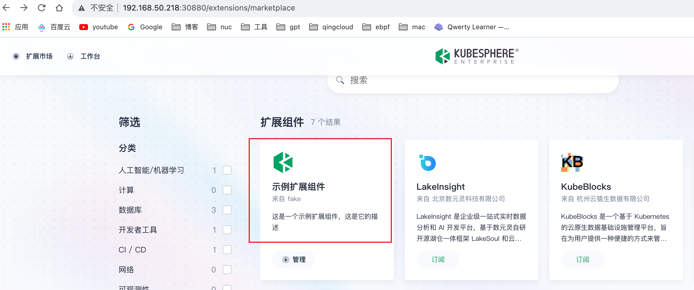
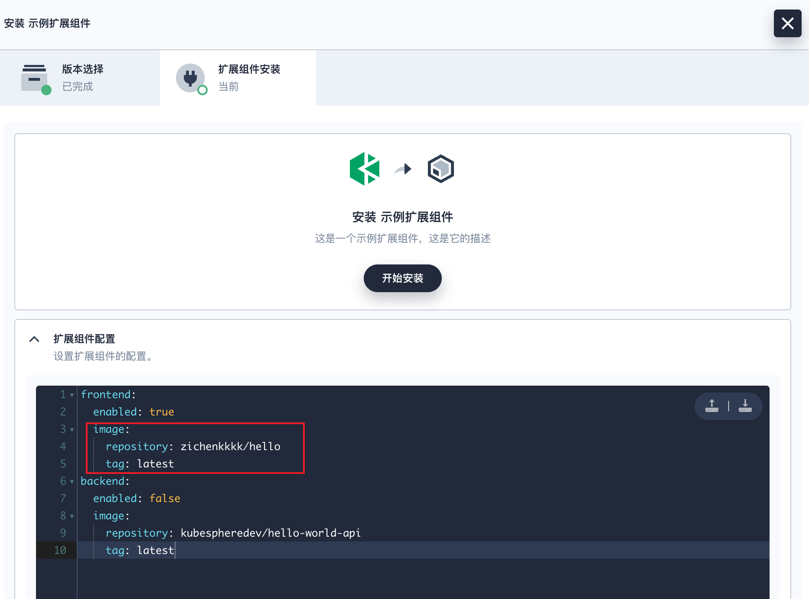
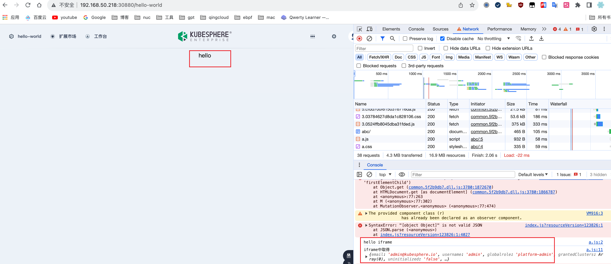

### 镜像制作

1. 编译

```bash
cd kubesphere-extensions/ks-console
yarn build:ext hello-world
# 生成文件
ls kubesphere-extensions/ks-console/extensions/hello-world/dist/index.js
```

2. 制作镜像

```bash
cd kubesphere-extensions/ks-console/extensions/hello-world/
docker build .
docker tag 500c030399f6 zichenkkkk/hello:latest
docker push zichenkkkk/hello:latest
```

### chart制作

下载 [latest ksbuilder release](https://github.com/kubesphere/ksbuilder/releases) 并移动到 `/usr/local/bin/`, 执行以下命令创建一个示例chart

```bash
➜ ksbuilder create
Please input extension name: hello-world
✔ other
Please input extension author: fake
Please input Email (optional): 
Please input author's URL (optional): 
Directory: /Users/inksnw/Desktop/hello-world

The extension charts has been created.
```

生成的chart项目`hello-world` 中, 由于我们只有前端 , 所以在`hello-world/value.yaml` 中, 关闭后端, 并修改前端镜像为我们刚推送的`zichenkkkk/hello:latest`

```yaml
frontend:
  enabled: true
  image:
    repository: zichenkkkk/hello
    tag: latest
backend:
  enabled: false
  image:
    repository: kubespheredev/hello-world-api
    tag: latest
```

打包

```bash
➜ ksbuilder package hello-world
package extension hello-world
package saved to /Users/inksnw/Desktop/hello-world-0.1.0.tgz
```

### 测试

推送安装包到集群

```bash
➜ ksbuilder publish hello-world-0.1.0.tgz
publish extension hello-world-0.1.0.tgz
creating Extension hello-world
creating ExtensionVersion hello-world-0.1.0
creating ConfigMap extension-hello-world-0.1.0-chart
```

此时在界面上即可看到我们的扩展已经提交



点击安装



访问,可以看到我们开发的扩展已经正常工作



调用链


以下配置也要整合进安装chart文件,测试阶段可以先不整合, 操作略

- 为你的iframe网页创建一个svc与pod, 即上图中的最后一步
- 后端ReverseProxy配置的yaml

### 发布

目前还未实现自动化发布, 请联系我们的商务人员手动提交chart包

