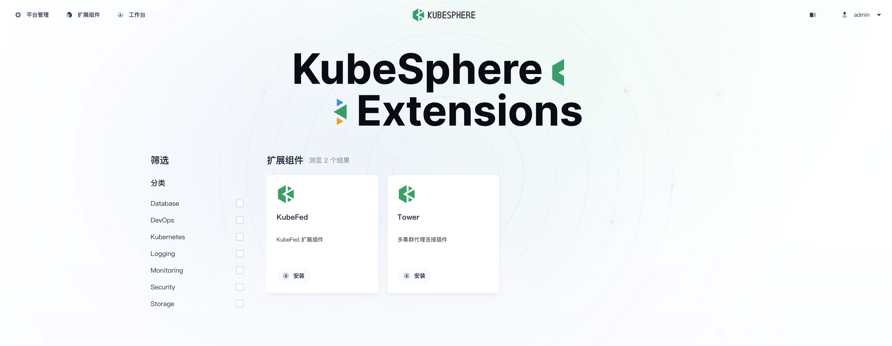

经过前面的章节，我们已经完成了扩展组件的开发与打包，在发布之前我们需要针对扩展组件做集成测试。

## 扩展组件上架

在扩展组件管理工程根目录（`~/workspace/kubesphere-extensions/`）执行下述命令，将扩展组件上架到 KubeSphere 扩展组件商店中。

```shell
ksbuilder publish employee
```

命令执行成功后，我们可以直接访问 kubesphere 容器 30880 端口打开 ks-console 页面并登录，查看扩展组件商店中上架的组件，并进行安装测试。



安装完成后可以在 ks-console 页面查看扩展组件安装状态，安装失败可以在默认的 namespace extension-employee 查看日志。

上述命令会将扩展组件上架到系统默认 kubeconfig 文件（`~/.kube/config`）所指向的集群，如果需要发布到指定的集群，可以使用 `--kubeconfig` 参数指定 kubeconfig 文件的路径：

```shell
ksbuilder publish employee --kubeconfig=/path/to/config
```
