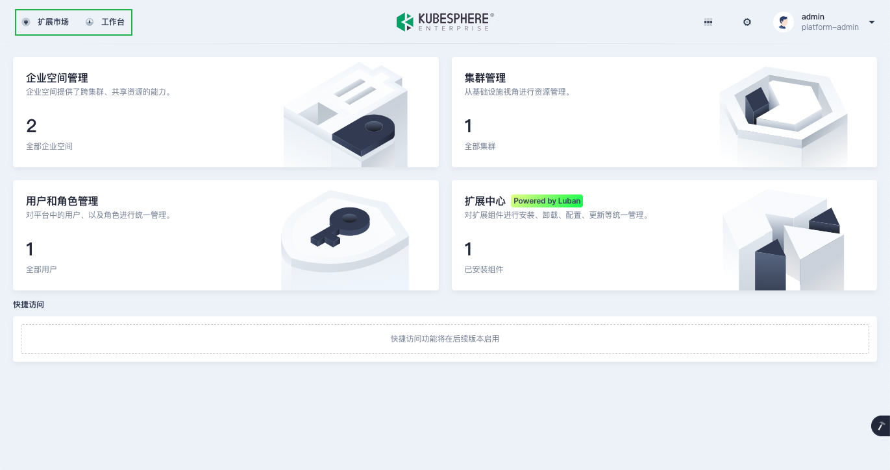
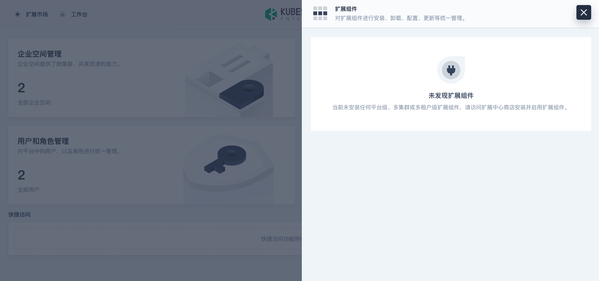

## 环境准备

1. 准备 Kubernetes 集群

   KubeSphere Luban 在任何 Kubernetes 集群上均可安装。可以使用 [KubeKey](https://github.com/kubesphere/kubekey) 快速部署 K8s 集群。

   ```bash
   curl -sfL https://get-kk.kubesphere.io | sh -
   ./kk create cluster --with-local-storage  --with-kubernetes v1.25.4 --container-manager containerd  -y
   ```

2. 安装 KubeSphere Luban。

   ```bash
   helm upgrade --install -n kubesphere-system --create-namespace ks-core  https://charts.kubesphere.io/test/ks-core-0.6.3.tgz --set apiserver.nodePort=30881 --debug --wait
   ```


3. 配置连接

   复制 K8s 集群的 [kubeconfig](https://kubernetes.io/zh-cn/docs/concepts/configuration/organize-cluster-access-kubeconfig/) 配置文件到开发主机的`~/.kube/config`，确保使用 kubectl 可以正常访问 K8s 集群。

   ```bash
   ➜  kubectl -n kubesphere-system get po
   NAME                                     READY   STATUS    RESTARTS       AGE
   ks-apiserver-7c67b4577b-tqqmd            1/1     Running   0              10d
   ks-console-7ffb5954d8-qr8tx              1/1     Running   0              10d
   ks-controller-manager-758dc948f5-8n4ll   1/1     Running   0              10d
   ```

## 初始化扩展组件

1. 执行以下命令初始化扩展组件开发项目：

   ```bash
   mkdir -p ~/kubesphere-extensions
   cd ~/kubesphere-extensions
   yarn add global create-ks-project
   yarn create ks-project ks-console
   ```

2. 执行以下命令创建 Hello World 扩展组件：

   ```bash
   cd ks-console
   yarn create:ext
   ```

   根据命令提示，设置扩展组件的名称、显示名称、描述、作者和语言等基础信息，完成扩展组件创建。

   ```bash
   Extension Name hello-world
   Display Name Hello World
   Description Hello World!
   Author demo
   Language JavaScript
   Create extension [hello-world]? Yes
   ```

3. 配置本地运行环境

   在 `kubesphere-extensions/ks-console/configs/local_config.yaml` 文件中进行如下配置。

   ```yaml
    server:
      apiServer:
        url: http://192.168.50.218:30881 # ks-apiserver 的 IP 与端口地址
        wsUrl: ws://192.168.50.218:30881 # ks-apiserver 的 IP 与端口地址
   ```

1. 执行以下命令运行：

   ```bash
   cd ~/kubesphere-extensions/ks-console/
   yarn dev
   ```

2. 打开浏览器，访问 `http://localhost:8000`，使用默认用户名 `admin` 和密码 `P@88w0rd` 登录,顶部导航栏将出现 `Hello World` 扩展组件的访问入口。

   

## 挂载位置

可修改`kubesphere-extensions/ks-console/extensions/hello-world/src/index.js` 设置挂载位置，例如：

```javascript
const menu = { 
  parent: 'topbar', //topbar:顶部菜单栏; global:扩展组件菜单; toolbox:工具箱菜单; access:用户和角色管理页面左侧导航栏; cluster/workspace/project:集群/企业空间/项目管理左侧导航栏; platformSettings:平台设置页面左侧导航栏;
  name: 'hello-world',
  link: '/hellow-world',
  title: 'HELLO_WORLD',
  icon: 'cluster',
  order: 0,
  desc: 'HELLO_WORLD_DESC',
  authKey: 'hello',
  authAction: 'hello-view',
  skipAuth: true,
};
```

位置示例: 顶部菜单栏



位置示例: 扩展组件菜单

在顶部菜单栏点击  图标打开菜单。



更多参数(快速入门可跳过)

<table>
  <colsgroup>
    <col style="width: 25%;">
    <col style="width: 75%;">
  </colsgroup>
  <thead>
    <tr>
      <th>参数</th>
      <th>描述</th>
    </tr>
  <thead>
  <tbody>
    <tr>
      <td>parent</td>
      <td>扩展组件的挂载位置，取值可以为：
        <ul>
          <li><strong>topbar</strong>：挂载到顶部菜单栏。</li>
          <li><strong>global</strong>：挂载到扩展组件菜单。</li>
          <li><strong>toolbox</strong>：挂载到工具箱菜单。</li>
          <li><strong>access</strong>：挂载到用户和角色管理页面左侧导航栏。</li>
          <li><strong>cluster</strong>：挂载到集群管理页面左侧导航栏。</li>
          <li><strong>workspace</strong>：挂载到企业空间管理页面左侧导航栏。</li>
          <li><strong>project</strong>：挂载到项目管理页面左侧导航栏。</li>
          <li><strong>platformSettings</strong>：挂载到平台设置页面左侧导航栏。</li>
        </ul>
        若要挂载到当前菜单的子菜单下，设置 parent 的路径为： <code>parent: 'cluster.xxxx.xxxx'</code>
      </td>
    </tr>
    <tr>
      <td>name</td>
      <td>
        <p>扩展组件在菜单上的位置标识。</p>
        <p>菜单的权限校验默认以 name 作为 key。设置 authKey 以指定模块权限进行校验。有关更多信息，请参阅<a href="../access-control">访问控制</a>。 </p>
      </td>
    </tr>
    <tr>
      <td>link</td><td>扩展组件的跳转路径。目前仅对 <code>parent</code> 取值为 <code>global</code> 和 <code>topbar</code> 时有效。</td>
    </tr>
    <tr>
      <td>title</td><td>扩展组件在菜单上显示的名称。请勿直接将参数值设置为硬编码的字符串，建议将参数值设置为词条的键，并通过 KubeSphere 提供的国际化接口实现多语言。有关更多信息，请参阅<a href="../internationalization">国际化</a>。</td>
    </tr>
    <tr>
      <td>icon</td><td>扩展组件在菜单上显示的图标的名称。</td>
    </tr>
    <tr>
      <td>order</td><td>扩展组件在菜单上的排列位次，取值为 <code>0</code> 或正整数。若取值为 <code>0</code>，表示扩展组件在菜单首位。</td>
    </tr>
    <tr>
      <td>desc</td><td>扩展组件在菜单上显示的描述文字，目前仅对 <code>parent</code> 取值为 <code>global</code> 和 <code>toolbox</code> 时有效。请勿直接将参数值设置为硬编码的字符串，建议将参数值设置为词条的键，并通过 KubeSphere 提供的国际化接口实现多语言。有关更多信息，请参阅<a href="../internationalization">国际化</a>。</td>
    </tr>
    <tr>
      <td>skipAuth</td><td>是否跳过用户权限检查。有关更多信息，请参阅<a href="../access-control">访问控制</a>。</td>
    </tr>
    <tr>
      <td>authKey</td><td>配置权限过滤。有关更多信息，请参阅<a href="../access-control">访问控制</a>。</td>
    </tr>
    <tr>
      <td>authAction</td><td>配置权限项。有关更多信息，请参阅<a href="../access-control">访问控制</a>。</td>
    </tr>


