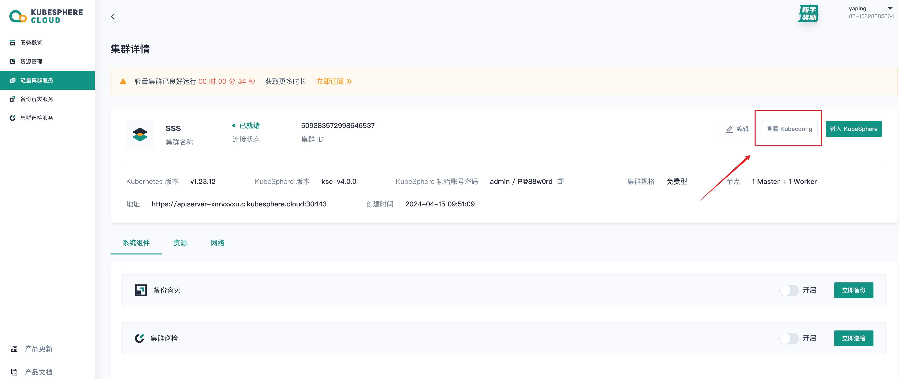

搭建开发环境，需要安装 KubeSphere Luban 和扩展组件开发所需的开发工具。

* KubeSphere Luban：准备 K8s 集群并部署 KubeSphere Luban Helm Chart，为扩展组件提供基础的运行环境。
* 开发工具：安装 [create-ks-project](https://github.com/kubesphere/create-ks-project) 和 [ksbuilder](https://github.com/kubesphere/ksbuilder) 用于初始化扩展组件项目、打包和发布扩展组件，你也可能需要用到以下开发工具 Node.js、Helm、kubectl 等。

## 安装 KubeSphere Luban

1. 准备 Kubernetes 集群

   KubeSphere Luban 在任何 Kubernetes 集群上均可安装。可以使用 [KubeKey](https://github.com/kubesphere/kubekey) 快速部署 K8s 集群。

   ```bash
   curl -sfL https://get-kk.kubesphere.io | sh -
   ./kk create cluster --with-local-storage  --with-kubernetes v1.25.4 --container-manager containerd  -y
   ```

   在 K8s 集群中[安装 Helm](https://helm.sh/zh/docs/intro/install/)。

   ```bash
   curl https://raw.githubusercontent.com/helm/helm/main/scripts/get-helm-3 | bash
   ```

2. 安装 KubeSphere Luban Helm Chart。

   ```bash
   helm upgrade --install -n kubesphere-system --create-namespace ks-core  https://charts.kubesphere.io/main/ks-core-0.4.0.tgz --set apiserver.nodePort=30881 --debug --wait
   ```

   更多配置参数，请参考[KubeSphere Helm Chart 配置](https://docs.kubesphere.com.cn/v4.0/03-install-and-uninstall/01-install-ks-core/#_%E9%AB%98%E7%BA%A7%E9%85%8D%E7%BD%AE)。

## 安装开发工具

除了 K8s 和 KubeSphere Luban 的环境搭建，开发主机上需要用到以下工具。

1. 安装开发扩展组件所需的开发工具

   * `Node.js` 和 `Yarn` 用于扩展组件的前端开发：安装 [Node.js](https://nodejs.org/en/download/package-manager) v16.17+ 和 [Yarn](https://classic.yarnpkg.com/lang/en/docs/install) v1.22+。
   * `Helm` 和 `kubectl` 用于扩展组件的编排和 K8s 集群管理： 安装 [Helm](https://helm.sh/docs/intro/install/) v3.8+ 和 [kubectl](https://kubernetes.io/zh-cn/docs/tasks/tools/#kubectl) v1.23+。
   * `ksbuilder` 用于扩展组件的打包与发布： 下载 [ksbuilder](https://github.com/kubesphere/ksbuilder/releases) 并保存到可执行文件目录。

2. 配置开发环境

   复制 K8s 集群的 [kubeconfig](https://kubernetes.io/zh-cn/docs/concepts/configuration/organize-cluster-access-kubeconfig/) 配置文件到开发主机上，确保使用 kubectl 可以正常访问 K8s 集群。

   ```bash
   ➜  ~ kubectl -n kubesphere-system get po
   NAME                                     READY   STATUS    RESTARTS       AGE
   ks-apiserver-7c67b4577b-tqqmd            1/1     Running   0              10d
   ks-console-7ffb5954d8-qr8tx              1/1     Running   0              10d
   ks-controller-manager-758dc948f5-8n4ll   1/1     Running   0              10d
   ```

   如果您使用的是 [KubeSphere Cloud](https://kubesphere.cloud/sign-up/) 上创建的集群，可在图中的位置下载 kubeconfig 文件。
   